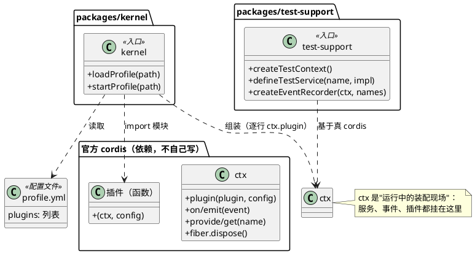
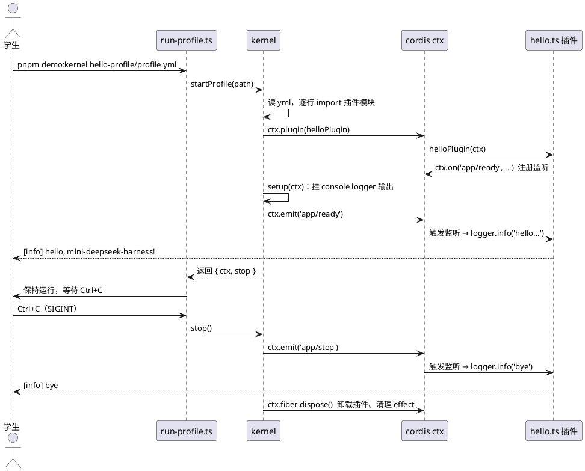
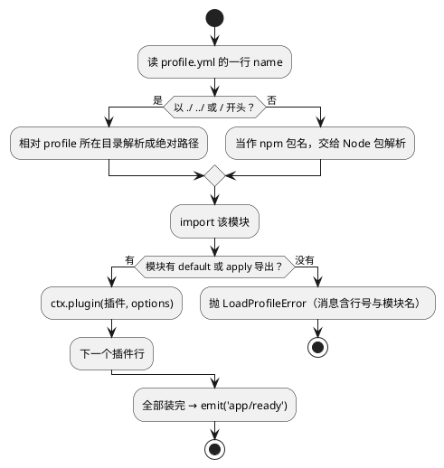

# M0 教程：什么是 CORDIS —— 内核、插件与 profile 组装

> 读者画像：AI 编程小白。你只需要会基础 TypeScript 和命令行；本文出现的每个新概念都从零解释。
> 本教程**不需要任何 API key**，所有命令可以复制即跑。

## 1. 动机：为什么第一课是"内核与组装"

你想做一个 AI agent 应用：用户发消息 → 模型回复 → 可能还要调工具、记日志、画轨迹……这些功能
怎么组织起来？新手的第一反应往往是一个大文件里写满 `if`：先调模型、再判断要不要调工具、顺手
写个日志。写 500 行还能忍，写 5000 行就崩了。

mini-deepseek-harness 的答案是**"一切皆为插件"**：

- 每个功能都是一个**插件**（打印日志是插件，调模型是插件，读文件也是插件）；
- 一份叫 **profile** 的配置文件，列出"我这个应用要哪些插件"；
- 一个**内核**负责把它们组装起来，互相之间通过**服务**和**事件**协作。

这个组装能力就是 CORDIS —— 后面每个里程碑都站在它上面：M1 的事件日志要挂在事件总线上，M2 的
假 LLM 要作为服务注入，M4 的 Web 界面也要作为插件装载。**没有组装，后面全是散沙。** 所以 M0
先把它做出来，并且用测试证明"空 profile 能启动、装了插件就能注入服务"。

monorepo 在这里起的作用：每个能力独立成一个包（`packages/kernel`、`packages/test-support`、
未来的 `packages/llm`……），彼此只通过**明确的接口**（seam）打交道。一个包坏了一个概念，不会
污染别的包；更重要的是，学生看目录就能看懂架构分层。

## 2. 设计：M0 做了什么

M0 交付三样东西：

1. **monorepo 骨架**：pnpm workspaces + 严格 TypeScript + Vitest，一套测试命令跑全仓。
2. **`packages/test-support`**：测试的公共语言（创建测试 ctx、注入测试服务、事件断言）。
3. **`packages/kernel`**：`loadProfile()` 读 `profile.yml`，逐行把插件用 cordis 装进 ctx。

### 2.1 整体结构（类图）



要点：kernel **不是内核**。内核是官方 `cordis` 包（这就是硬约束 §2.1）。kernel 只做"翻译"：
把 yml 里的一行行文字，变成对 `ctx.plugin()` 的一次次调用。

### 2.2 启动流程（时序图）



两个时间点值得记住：`app/ready` 是"全部插件装好了，可以干活了"的**广播**；`app/stop` 是"要
收摊了"的**广播**。插件不直接互相调用，而是"听广播 + 广播给世界"——这就是事件协作。

### 2.3 一行插件是怎么被找到并装载的（流程图）



## 3. 新概念（第一次出现，从零解释）

### CORDIS
一个 TypeScript **插件框架**：应用 = 一组插件在一个**上下文（ctx）**里的组合。它管三件事：
插件的装载与卸载、服务的依赖注入、事件的发布订阅。mini 项目直接用官方 `cordis` npm 包，
自己只写插件层。

### ctx（Context，上下文）
"运行中的装配现场"。一个应用启动后就有**一个根 ctx**，每个插件在装载时得到**自己的子 ctx**
（继承根 ctx 的一切，但生命周期跟随该插件）。你所有的服务、事件监听都挂在 ctx 上；插件被
卸载时，它 ctx 上挂的东西会被自动清理（这就是后文说的 effect）。

### 服务（service）
挂在 ctx 上的**命名对象**。提供方：`ctx.provide('greeting', 对象)`；取用方：`ctx.get('greeting')`，
或声明 `inject: ['greeting']` 后直接写 `ctx.greeting`。依赖注入（DI）的本质：**用的人不需要知道
谁提供的、怎么构造的**，换一个提供方不用改使用方。假 LLM 就是这么换进来的（M2 你会看到）。

### 事件（event）
一个**名字 + 若干参数**的广播。发布：`ctx.emit('say', '你好')`；订阅：`ctx.on('say', (msg) => ...)`。
事件是单向的"喊一嗓子"，喊的人不知道、也不关心谁在听——所以插件之间可以零耦合地协作。
本项目的事件类型靠 TypeScript 的**模块增强**声明：`declare module 'cordis' { interface Events { ... } }`，
写完以后 `ctx.emit('没声明过的名字')` 会直接编译报错。

### 插件（plugin）
最小的功能单元，形如 `(ctx, config) => { ... }` 的函数：用 ctx 提供服务、订阅事件、注册清理动作。
在 profile 里，它只是**一行文字**（模块路径/包名 + 可选的 options）。

### profile 组合
把"要哪些插件、各配什么"写进 `profile.yml` 的数据。换一份 profile 就是换一个应用——**组合是
数据，不是代码**。这是"一切皆为插件"哲学的直接产物。

### monorepo
一个 git 仓库里放多个 npm 包，用 pnpm workspaces 统一管理。好处：跨包改动原子化（一次 commit
同时改两个包）、统一版本、测试一条命令跑全仓。包之间引用写包名（`@mini-dsh/test-support`），
就像引用第三方库一样——边界清晰。

### seam
**"为将来预留的接缝"**：一个抽象接口 + 至少一个实现。比如"LLM"是一个 seam——现在只有
OpenAI 兼容 adapter 一个实现，将来接 Ollama 就是加实现，不用改 agent 主循环。你可以把 seam
理解成"盖楼时预留的管井"。

### TDD（测试驱动开发）
先写一个**失败**的测试表达期望行为（RED）→ 写最少代码让它通过（GREEN）→ 清理代码保持全绿
（REFACTOR）。本项目所有功能代码都遵守它；你在本仓库的 git log 里能看到成对的
"RED: ... / GREEN: ..."提交。

## 4. 取舍（tradeoff）与理由

### 为什么用官方 cordis，而不是自己写内核
手写内核 = 用 500 行边角 case（异步装载、作用域隔离、清理顺序）换一个"我全懂"的幻觉；
官方 cordis 是 113k+ stars 的上游项目在用的同一内核，教学价值是"学会站在巨人的肩膀上"。
硬约束也明确禁止手写（§2.1）。注意：cordis v4 的 npm 版本还在 rc（4.0.0-rc.8），我们选了它
而不是老 v3，因为官方包的最新代就是它、上游 vendor 的也是 v4 一代，教学要贴近现状。

### 为什么 test-support 要先于一切业务包
因为 TDD 的**断言方式本身就是架构决策**：本项目断言的是"事件日志"而不是内部变量。先把
"创建 ctx、注入假服务、断言事件"这三件套做成公共语言，M1 的事件词汇测试、M2 的假 LLM 才
有立足点。先立习惯，再造工具。

### 为什么 profile 用 yml 列表，而不是代码硬编码
硬编码（`const plugins = [helloPlugin]`）改组合就要改代码、重新编译；yml 让组合成为**可
diff、可分享、可教学**的数据。代价是运行时才 import 模块、错误要自己报清楚（我们为此专门
做了带行号的 `LoadProfileError`）。上游原版同样用 yml（`*.cordis.yml`），方向一致。

### 为什么每个包 exports 直接指向 src/*.ts（不构建）
教学项目第一优先是"改一行立刻生效、测试立刻反映"。源码直用 + `moduleResolution: bundler`
（vitest/tsx 天然支持）省掉整个构建链。代价：将来发布 npm 包时要补构建——那是"将来"的事，
M0 不提前背债。

### 为什么测试里的事件名要"放宽类型"
cordis 把事件名收窄到 `keyof Events`（好事：拼错名字编译报错），但 `createEventRecorder`
是"任何事件都能记"的通用工具，事件名运行时才知道。所以那里**有意地**做了类型放宽——这是全
项目少数几处显式 cast 之一，代码注释里有说明。原则：通用工具放宽，业务代码严格。

## 5. 动手练习：给你的 profile 加一个"打印事件"的插件

目标：复制一份 profile，加一个自己写的插件，跑起来看到自己的输出。零 API key，全程本地。

### 步骤 0：准备（第一次来才需要）

```sh
pnpm install
```

### 步骤 1：先跑一遍官方示例

```sh
pnpm demo:kernel packages/kernel/examples/hello-profile/profile.yml
```

期望输出（前两行立刻出现，然后程序保持运行，Ctrl+C 退出）：

```
[info] hello, mini-deepseek-harness!
[info] profile 已启动: packages/kernel/examples/hello-profile/profile.yml（Ctrl+C 停止）
[info] bye
```

### 步骤 2：复制一份属于自己的 profile

```sh
mkdir -p my-profile/plugins
cp packages/kernel/examples/hello-profile/profile.yml my-profile/profile.yml
cp packages/kernel/examples/hello-profile/plugins/hello.ts my-profile/plugins/hello.ts
```

### 步骤 3：改 `my-profile/plugins/hello.ts`，让它打印"你的名字"

把文件内容替换成（注意 `logger.info` 的第一个参数是格式化串，`%s` 是占位符）：

```ts
import type { Context } from 'cordis'

export default function myPlugin(ctx: Context) {
  ctx.on('app/ready', () => {
    ctx.logger.info('你好，%s！我是一个自定义插件', '小明')
  })
  ctx.on('app/stop', () => {
    ctx.logger.info('再见')
  })
}
```

### 步骤 4：跑你自己的 profile

```sh
pnpm demo:kernel my-profile/profile.yml
```

期望输出：

```
[info] 你好，小明！我是一个自定义插件
[info] profile 已启动: my-profile/profile.yml（Ctrl+C 停止）
[info] 再见
```

### 步骤 5（进阶，可选）：再加一行插件，试试 options 是怎么传进去的

在 `my-profile/plugins/` 下新建 `shout.ts`：

```ts
import type { Context } from 'cordis'

export interface ShoutConfig {
  words?: string
}

export default function shoutPlugin(ctx: Context, config: ShoutConfig = {}) {
  ctx.on('app/ready', () => {
    ctx.logger.info('喊一嗓子：%s', config.words ?? '啊——')
  })
}
```

然后修改 `my-profile/profile.yml`：

```yaml
plugins:
  - name: ./plugins/hello.ts
  - name: ./plugins/shout.ts
    options:
      words: 一切皆为插件！
```

再跑 `pnpm demo:kernel my-profile/profile.yml`，观察两个插件按 profile 顺序装载、各自监听同一个
`app/ready` 事件、按注册顺序打印。**你没有改任何一行 kernel 代码**——这就是 profile 组合。

### 步骤 6（进阶，可选）：给自定义插件写一个测试

新建 `my-profile/plugins/hello.test.ts`：

```ts
import { describe, expect, it } from 'vitest'
import { createEventRecorder, createTestContext } from '@mini-dsh/test-support'
import helloPlugin from './hello'

declare module 'cordis' {
  interface Events {
    'greet'(name: string): void
  }
}

describe('我的插件', () => {
  it('收到 greet 事件时把名字记录下来', async () => {
    const { ctx, dispose } = await createTestContext()
    await ctx.plugin(helloPlugin)
    // 让 hello.ts 在 greet 事件上做点什么再断言？试试自己动手：
    // 1) 在插件里 ctx.on('greet', ...) 2) 这里 emit 3) 用 recorder 断言
    await dispose()
  })
})
```

> 上面是骨架题：给 `hello.ts` 加一个 `ctx.on('greet', ...)` 的监听，用 `createEventRecorder`
> 断言"emit 之后记录里有一条对应事件"。做出来说明你已掌握 M0 的全部核心概念。

## 6. 常见问题

**Q：`ctx` 到底是什么类型，能当普通对象用吗？**
它是 cordis 的 Context（一个 Proxy）。挂服务和事件要走 `provide`/`on`/`emit` 这类方法，不要
直接 `ctx.foo = 1`（cordis 会拒绝没有 provide 的属性赋值）。

**Q：为什么 logger 的输出要我手动挂 exporter？**
裸 cordis 的 logger 只做缓冲，没有控制台输出（上游用一个 `logger-console` 插件做这件事）。
M0 的演示启动器里内联了三行 console exporter；将来需要时它会变成 mini 版自己的 logger 插件。

**Q：`pnpm test` 和 `pnpm typecheck` 有什么区别？**
`pnpm test` 跑行为断言（Vitest），`pnpm typecheck` 只做类型检查不运行代码。两个都绿才算数。

**Q：修改代码后测试不重跑？**
开发时用 `pnpm test:watch`，保存即自动重跑。

## 7. 小结

这一课你建立了整个项目的地基：**应用 = profile 里的一行行插件，在 ctx 上通过服务与事件协作**。
记住三个词：**ctx**（装配现场）、**profile**（组合是数据）、**事件**（零耦合协作）。
下一篇（M1）我们给会话引入**事件词汇**——用户说了什么、助手回了什么，都变成一条条
append-only 的事件日志，那才是"轨迹（Trajectory）灵魂"的起点。
