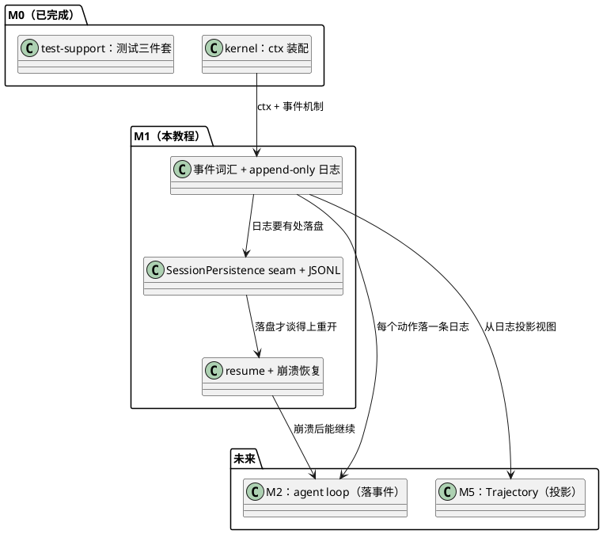
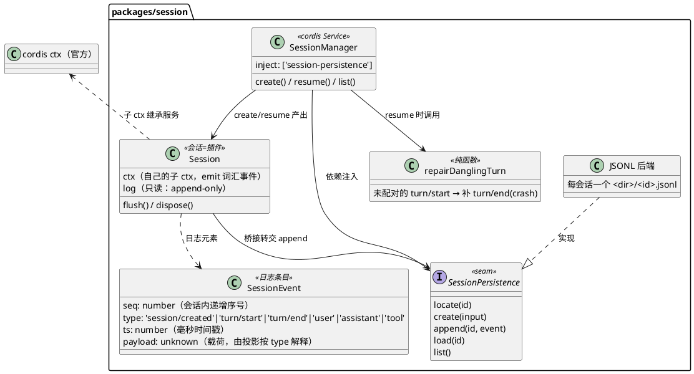
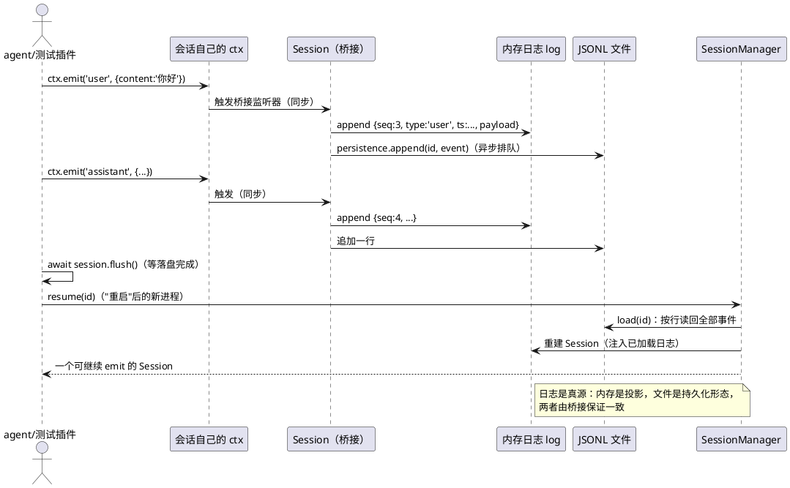
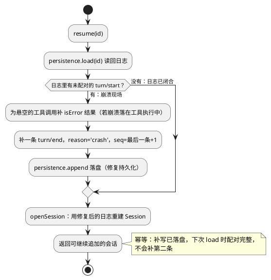

# M1 教程：事件日志与真源 —— 为什么 append-only、崩溃恢复

> 读者：AI 编程小白，只需要会基础 TypeScript 和命令行。全部练习**零 API key** 可跑。
> 前置：M0 教程（什么是 CORDIS：ctx、服务、事件、插件）。本教程的所有代码都在
> `packages/session/`，演示命令 `pnpm demo:session`。

## 1. 动机：为什么 loop 之前先有日志词汇

M0 给了我们一个"装配现场"（ctx）和测试三件套，但还没回答一个问题：**一个会话（session）到底是什么？**

接下来的 M2 要写 agent loop（"用户发消息 → 模型回复"的循环），M5 要做 Trajectory（轨迹视图，
这个项目的"灵魂"）。这两个东西都依赖同一个地基：

- loop 每走一步（用户消息、模型回复、工具调用）都必须**有处安放**；
- 轨迹视图必须**有处投影**（把历史画出来）。

所以 M1 抢在 loop 之前定义：**会话 = 一段 append-only（只追加）的事件日志**。日志里每一条就是
一个"发生过的事实"，loop 只是产生这些事实的来源之一。这个顺序一旦反过来（先写 loop，再想
"顺便记点什么"），日志就会变成事后补丁，而不是真源。

M1 在整条路线里的位置：



## 2. 设计：M1 做了什么

M1 交付四样东西：**事件词汇**（五种事件名 + 一条头记录）、**Session**（append-only 内存日志 +
桥接）、**SessionPersistence seam + JSONL 后端**（落盘）、**SessionManager**（新建 / resume /
列表，含崩溃恢复）。

### 2.1 全景（类图）



要点：

1. `Session` 本身也是插件（"一切皆为插件"连会话都不例外）——它挂在根 ctx 上，得到自己的
   **子 ctx**（继承根的服务）与独立的生命周期（dispose 时桥接自动摘除）。
2. 持久化是**抽象服务**（seam），JSONL 只是第一个实现。将来 SQLite 后端只换实现，别处零改动。

### 2.2 事件流：emit → 桥接 → 日志 → 落盘 → 读回（时序图）



注意两件事：桥接是**同步**追加（emit 的瞬间内存日志就更新了），落盘是**异步排队**的
（`flush()` 在需要读文件前等待）；emit 方从头到尾**不知道**桥接和文件的存在。

### 2.3 崩溃恢复（流程图）



判断方式不是"最后一条是不是 turn/start"，而是**配对是否完整**：最后一条 `turn/start` 出现在
最后一条 `turn/end` 之后（或根本没有 `turn/end`）。因为崩溃最常见的现场是 `turn/start → user`
写到一半就戛然而止——末尾是 `user`，但这一轮并没有闭合。

### 2.4 一个 JSONL 文件长什么样

`pnpm demo:session` 之后打开 `./.mini-dsh/sessions/<id>.jsonl`：

```jsonl
{"seq":1,"type":"session/created","ts":1786827706927,"payload":{"id":"s-msuv2yi7-4yfh4x","title":"正常会话","createdAt":1786827706927}}
{"seq":2,"type":"turn/start","ts":1786827706927}
{"seq":3,"type":"user","ts":1786827706927,"payload":{"content":"你好"}}
{"seq":4,"type":"assistant","ts":1786827706928,"payload":{"content":"你好呀！"}}
{"seq":5,"type":"turn/end","ts":1786827706928,"payload":{"reason":"done"}}
```

- 首行永远是 `session/created` **头记录**（`seq: 1`，payload 是会话 meta）——它是 create 时
  直接写进去的，**不是事件**，这是日志里唯一不来自 emit 的记录（"创世记录"）。
- 之后每行一条 `SessionEvent`；`seq` 单调递增；每行独立、肉眼可读 —— 这就是选 JSONL 的意义。

## 3. 新概念（第一次出现，从零解释）

### 3.1 append-only 日志（append-only log）

**只能往后追加、不能修改或删除的历史记录**。`session.log` 的类型是 `readonly SessionEvent[]`，
连 `push` 都是编译错误——"不能改"由类型系统强制执行，而不只是口头约定。为什么这么较真？
因为日志是"发生过的事实"，事实不可改写；要修正事实，就追加一条新事实（崩溃恢复就是追加一条
`turn/end`，而不是去改掉之前的 `turn/start`）。

### 3.2 事件词汇（event vocabulary）

**一套预先约定好的事件名 + 载荷形状**。M1 的词汇表：`turn/start`、`turn/end`、`user`、
`assistant`、`tool`（外加头记录 `session/created`）。词汇通过 cordis 的模块增强写进类型系统：
`ctx.emit('foo/bar')` 直接编译报错——"说同一种语言"是类型层面的契约。词汇要**先于** loop 存在，
否则每个新功能都在发明自己的事件名，日志就没法被任何人理解。

### 3.3 真源（source of truth）

**"以谁为准"的那个唯一权威**。本项目的答案是：事件日志。内存里的数组、JSONL 文件、将来的
Trajectory 视图，全部是日志的**不同形态**，而不是另一份数据。判断标准：如果两份东西冲突了，
听日志的；丢失了任何其他东西，日志都能重建它。

### 3.4 投影（projection）

**从日志"算"出来的视图**。M5 的 Trajectory 是投影：它不存任何自己的状态，只是把日志按轮
分组、算 token 数、展示出来。投影可以随时重建、可以有多个（同样的日志，一个投影画表格，
另一个画时间线）。M1 只预告不实现——但 append-only 日志是投影成立的前提（能改的历史没法投影）。

### 3.5 seam

**"将来会换掉的东西"的抽象接口**。M1 的 seam 是 `SessionPersistence`：契约五件套
`locate / create / append / load / list`。现在 JSONL 实现它，将来 SQLite 另写一个实现、
通过同一份契约测试即可——agent loop 一行不改。M0 教程里见过这个词的预告，这里第一次见到
实物：**接口 + 至少一个实现 + 一份可复用的契约测试**。

### 3.6 JSONL

**每行一个 JSON 对象的文本文件格式**。不需要数据库、不需要驱动，读写都是几行 Node 代码；
坏了哪一行，其他行还在；`cat` 就能看。对"教学上想让日志看得见"的场景，它是正解。

### 3.7 崩溃恢复与幂等（idempotent）

进程可能在任意时刻被杀死（断电、`kill -9`、异常退出）——日志会停在半路。**崩溃恢复**：下次
resume 时发现"这轮对话没闭合"，补一条 `turn/end { reason: 'crash' }`。**幂等**：这个修复动作
重复执行结果不变——补写的 `turn/end` 已被持久化，第二次 resume 配对已完整，不会再补第二条。

### 3.8 桥接（bridge）

**"事件 → 日志"的同步转发器**。它只是监听词汇事件、把每条事件转成日志条目，没有自己的逻辑。
emit 方不知道谁在听；桥接不知道谁在说。两边通过"事件名"这个词汇表达成契约。

## 4. 取舍（tradeoff）与理由

### 4.1 为什么是 emit→append 桥接，而不是直接调 `session.append()`

直接调 `session.append(...)` 也能把东西写进日志，但那样就存在**两条行为路径**：一边 emit 事件、
一边手动 append，日志"既是事件流又是方法调用流"。UI 和测试就无法统一"看事件"这件事——事件
断言会漏掉所有绕过 emit 的 append。桥接让**日志内容 == 事件流的完整镜像**，这个等式是 M2 之后
一切测试手法的根基。代价：多一层间接、落盘变成异步——用 `flush()` 换回确定性。

### 4.2 为什么 JSONL 而不是 SQLite

SQLite 会更快、更强（查询、事务、并发），但它的代价是**把"日志就是日志"这个事实藏进 B-tree**。
M1 的教学目标是看清 append-only 的结构本身；我们的规模（单进程、每个会话一个文件、顺序追加）
根本用不上查询能力。SQLite 在 backlog 里排队——届时它的意义恰好是**演示 seam 换后端**：
同样的契约测试，换个实现全绿。

### 4.3 为什么单文件追加、不做事务

写入中途崩溃会留下坏行（半行 JSON）。两个选择：(a) 上事务/WAL/校验和，把崩溃窗口缩到接近零；
(b) 承认窗口存在，用**恢复逻辑兜底**——按行解析，坏行报错、断尾补 `turn/end`。教学项目选 (b)：
复杂度大幅下降，而且"承认不完美 + 设计兜底"本身就是值得学的一课。真实系统会两样都要；
backlog 的 SQLite 后端自然会带上事务。

### 4.4 为什么日志是真源，而不是"数据库行 + UI 状态"

"数据库存一条消息记录，UI 再维护一份展开/选中/滚动状态"是常见做法——但两份真相迟早漂移，
调试时永远在猜"哪份是新的"。日志为真时：UI 状态只是投影，丢掉可以重算；消息记录只是日志的
物化，删除日志就能重建。判断"什么该是真源"的简单标准：**哪个东西一旦丢了，别的都变成废纸**。
在 agent 系统里，答案是"发生过什么"——即日志。

### 4.5 为什么头记录由 create 直接写，而不是 emit 出来

头记录 `session/created` 是"创世记录"：它描述会话的诞生（id、标题、创建时间），先于一切
对话。如果它是 emit 出来的，就会产生鸡生蛋问题——emit 需要会话先存在，而"会话存在"这件事
本身正是头记录要记录的事实。所以它由 `create` 直接落盘，也是日志里唯一不来自事件的记录。

### 4.6 为什么每个会话一根独立的事件总线（隔离的代价）

cordis 的子 ctx 默认**共享**根 ctx 的事件总线。若不加隔离，同一个进程里两个并存会话的桥接
会互相收到对方的 emit——演示脚本一度因此把 A 会话的事件写进 B 会话（这个 bug 就是被演示
暴露、再补测试修掉的）。解法：会话 ctx 定义自己的 `EventsService` 实例。代价：根 ctx 听不到
会话内部事件。这在本架构里不是损失——真源是日志，观察者读日志而不是听总线。

## 5. 小白看这份代码，按什么顺序读

先跑起来，再按"数据长什么样 → 谁产生数据 → 谁消费数据"的顺序读：

1. **先跑**：`pnpm demo:session --clean`，对着 2.4 的 JSONL 样例看懂三幕输出。
2. **`src/events.ts`** —— 词汇表与 `SessionEvent` 形状（问题：日志条目长什么样？）。
   注意 `declare module 'cordis'` 的模块增强：这是 M0 实证过的"事件类型化"机制。
3. **`src/session.ts`** —— `Session` 类（问题：谁把 emit 变成日志？）。
   先找桥接循环（`SESSION_EVENT_NAMES` 的 `for`），再看 `append()` 的同步推内存 +
   异步排队落盘，最后看 `Object.defineProperty(ctx, 'events', ...)` 的隔离注释。
4. **`src/persistence.ts`** —— seam 契约与 `SessionNotFoundError`（问题：持久化承诺了什么？）。
   五个方法就是五个承诺，读完再去看实现。
5. **`src/backends/jsonl.ts`** —— 契约的 JSONL 实现（问题：承诺怎么兑现？）。
   每方法都短；重点看 `create` 写头记录、`append` 先查存在再追加、`load` 按行解析。
6. **`src/manager.ts`** —— `SessionManager`（问题：会话怎么创建/重开？）。
   重点看 `static inject` 与 `this.ctx['session-persistence']`——这就是"依赖注入 seam"。
7. **`src/repair.ts`** —— 崩溃恢复的纯函数（问题：断尾怎么发现？）。就一个循环，找最后的
   `turn/start` 与 `turn/end` 的位置比较。
8. **回看 `tests/`** —— 每个契约测试名都是一句中文行为描述，测试顺序就是行为的重要性顺序。
   特别看 `tests/contracts/persistence-contract.ts`：它就是"seam 可换"的证明方式。

## 6. 动手练习（零 API key）

### 步骤 0：准备（第一次来才需要）

```sh
pnpm install
```

### 步骤 1（主练习）：跑通三幕演示

```sh
pnpm demo:session --clean
```

对照 2.4 节读懂输出：第一幕正常会话落盘；第二幕"崩溃"（只有 `turn/start → user` 就停了）；
第三幕"重启"后 resume——正常会话历史完整回放，崩溃会话末尾出现补写的
`#4 turn/end {"reason":"crash"}`。再跑一次：`--clean` 会清空目录，注意这次生成了**新的会话 id**
（id 里带时间戳，这就是"append-only 历史不可覆盖"的直觉）。

### 步骤 2（进阶）：亲手制造一次真崩溃

这次不用演示脚本"假装"崩溃，而是**真的杀掉进程**。仓库里有两个练习脚本
`packages/session/examples/my-crash.ts` 与 `my-resume.ts`（代码见附录，也可直接照抄）。

```sh
# 1) 写一半就自杀（SIGKILL，连捕获异常的机会都没有）
pnpm tsx packages/session/examples/my-crash.ts /tmp/my-sessions
#    打印：会话 id：s-xxxxxx-xxxxxx  ← 记下这个 id

# 2) 亲眼看看"断尾"：最后一行是 user，根本没有 turn/end
cat /tmp/my-sessions/s-xxxxxx-xxxxxx.jsonl

# 3) "重启"：resume 这个会话，观察自动补上的 turn/end
pnpm tsx packages/session/examples/my-resume.ts /tmp/my-sessions s-xxxxxx-xxxxxx

# 4) 再看文件：补写的 turn/end 已经落盘（幂等：再跑一次步骤 3，不会补第二条）
cat /tmp/my-sessions/s-xxxxxx-xxxxxx.jsonl
```

验收标准：步骤 3 的输出最后一条是 `#4 turn/end {"reason":"crash"}`；步骤 4 的文件比步骤 2
多一行；重复步骤 3 日志条数不变。

### 步骤 3（进阶，可选）：换目录看文件布局 + 手搓断尾

```sh
# 换一个目录，观察"每个会话一个文件"的布局
pnpm demo:session --dir /tmp/my-sessions --clean
ls /tmp/my-sessions            # 每个会话一个 <id>.jsonl

# 手搓一个断尾文件，看恢复逻辑的边界：
# 新建 /tmp/my-sessions/s-handmade.jsonl，内容为（注意第 2 行末尾故意没有 turn/end）：
# {"seq":1,"type":"session/created","ts":1,"payload":{"id":"s-handmade","title":"手搓","createdAt":1}}
# {"seq":2,"type":"turn/start","ts":2}
pnpm tsx packages/session/examples/my-resume.ts /tmp/my-sessions s-handmade
```

验收标准：手搓文件 resume 后出现 `#3 turn/end {"reason":"crash"}`。

## 7. 常见问题

**Q：`ts` 是毫秒时间戳，`seq` 是会话内序号——谁负责分配？为什么不是数据库自增？**
`Session` 的桥接分配 `seq`（内存日志与落盘共用同一套值）。不用数据库自增是因为日志要先在
内存成立（桥接同步追加），数据库只是落盘形态；真源没有数据库也能活。

**Q：`flush()` 是什么？什么时候必须 await？**
桥接同步更新内存日志，但落盘是异步排队的。`flush()` 等到**当前所有已 emit 的事件都写进文件**。
只在"读文件之前"需要它（测试、demo、resume 前）；纯内存观察 `session.log` 不需要。

**Q：`session.dispose()` 之后 emit 会怎样？**
桥接监听器随会话 fiber 一起摘除，之后的 emit 不再进日志。dispose 前会先 flush（不丢已 emit 的
事件）。

**Q：为什么根 ctx 听不到会话内部的事件？**
因为每个会话有独立的事件总线（4.6 的取舍）。观察历史请读日志（真源），而不是听总线。

**Q：日志坏了半行（写入中途断电）怎么办？**
按行解析会抛错——这是"承认崩溃窗口"的代价（4.3）。教学版不自动修复坏行（报错本身就是教学）；
真实系统靠事务/校验和，那是 SQLite 后端（backlog）的功课。

**Q：一次会话两轮对话都没写 turn/end，能修几条？**
MVP 假设单轮串行（M2 的 loop 也是串行的），修复逻辑只补**最后一轮**的 turn/end（以及它
悬空的工具调用结果）。多轮并发是 M2 之后才可能出现的场景，届时再谈配对栈。

## 8. 小结

- 会话 = 一段 **append-only 事件日志**；词汇（事件名 + 载荷）是类型层面的契约。
- **emit → 桥接 → 日志** 让"日志 == 事件流的镜像"恒成立；日志是真源，一切视图都是投影。
- 持久化是 **seam**：契约五件套 + JSONL 实现 + 可复用的契约测试，换后端零改动。
- **崩溃恢复**：发现未闭合的 `turn/start` → 补一条 `turn/end {reason:'crash'}`，幂等；
  若崩溃落在工具执行中，还会先为没有结果的调用补一条 isError 工具结果。
- 下一步 M2：agent loop 登场——它的每一动都会 emit 词汇事件，落进这段日志；M1 的
  `flush/resume` 是它"每一步都安全"的地基。

## 附录：练习脚本全文

`my-crash.ts`（仓库路径 `packages/session/examples/my-crash.ts`）：

```ts
/**
 * M1 教程练习脚本：写一半就"崩溃"（SIGKILL 自杀），制造一个断尾日志。
 * 用法：pnpm tsx packages/session/examples/my-crash.ts [目录]
 *   默认目录 ./.mini-dsh/sessions；跑完把打印出来的会话 id 交给 my-resume.ts。
 */
import { mkdir } from 'node:fs/promises'
import { resolve } from 'node:path'
import { Context } from 'cordis'
import { jsonlPersistence, SessionManager } from '@mini-dsh/session'

const dir = resolve(process.argv[2] ?? '.mini-dsh/sessions')

async function main(): Promise<void> {
  await mkdir(dir, { recursive: true })
  const ctx = new Context()
  await ctx.plugin(jsonlPersistence, { dir })
  await ctx.plugin(SessionManager)
  const manager = ctx.get('session-manager')!

  const session = await manager.create({ title: '练习：写到一半的会话' })
  session.ctx.emit('turn/start')
  session.ctx.emit('user', { content: '这句说完，进程就被杀了……' })
  await session.flush() // 确保已写进文件

  console.log(`会话 id：${session.id}`)
  console.log(`日志文件：${resolve(dir, `${session.id}.jsonl`)}`)
  console.log('进程即将被 SIGKILL 杀死（来不及 emit turn/end）……')
  process.kill(process.pid, 'SIGKILL')
}

main().catch((error) => {
  console.error(error)
  process.exit(1)
})
```

`my-resume.ts`（仓库路径 `packages/session/examples/my-resume.ts`）：

```ts
/**
 * M1 教程练习脚本：resume 一个断尾会话，观察自动补写的 turn/end（reason: crash）。
 * 用法：pnpm tsx packages/session/examples/my-resume.ts [目录] <会话id>
 *   <会话id> 由 my-crash.ts 打印出来。
 */
import { resolve } from 'node:path'
import { Context } from 'cordis'
import { jsonlPersistence, SessionManager } from '@mini-dsh/session'
import type { SessionEvent } from '@mini-dsh/session'

const dir = resolve(process.argv[2] ?? '.mini-dsh/sessions')

function requireSessionId(): string {
  const value = process.argv[3]
  if (value === undefined) {
    throw new Error('用法：pnpm tsx packages/session/examples/my-resume.ts [目录] <会话id>')
  }
  return value
}

const id = requireSessionId()

function render(events: readonly SessionEvent[]): string {
  return events
    .map((e) => `  #${String(e.seq).padStart(2)} ${e.type.padEnd(16)} ${JSON.stringify(e.payload ?? '')}`)
    .join('\n')
}

async function main(): Promise<void> {
  const ctx = new Context()
  await ctx.plugin(jsonlPersistence, { dir })
  await ctx.plugin(SessionManager)
  const manager = ctx.get('session-manager')!

  const session = await manager.resume(id)
  console.log(`resume 后的完整日志：\n${render(session.log)}`)
  console.log('\n注意最后一条：turn/end 的 reason 是 crash —— 崩溃恢复补写的（幂等：再 resume 也不会补第二条）。')
  await ctx.fiber.dispose()
}

main().catch((error) => {
  console.error(error)
  process.exit(1)
})
```
