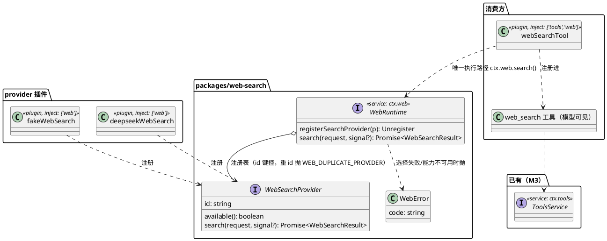
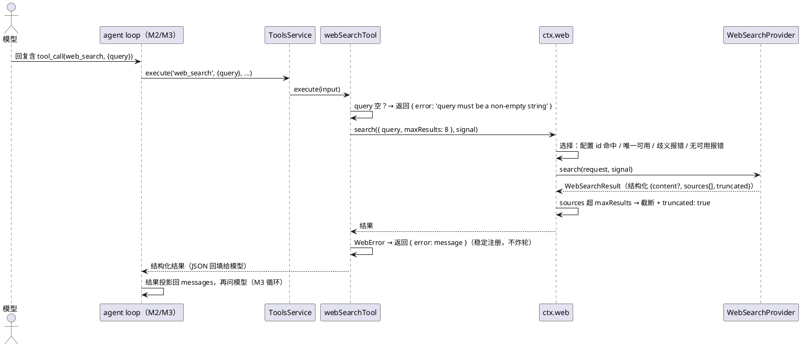

# M10 教程：web search —— 一个工具、多个"后端"

> 本教程对应 M10（web search 插件）。读者：AI 编程小白（会基础 TypeScript 与命令行）。
> 全程**零 API key** 可跟做。前置：M0（CORDIS）、M2（seam 与假 LLM）、M3（Tools 注册表）、M6（注册可逆）。
> 代码在 `packages/web-search/`。

## 1. 动机：这个 M 解决什么问题、为什么排在这里

到 M9 为止，mini 的工具都是"本地货"：bash、文件读写、skill、subagent、MCP 工具。
但一个 agent 经常要回答**实时问题**——"DeepSeek 现在最新的模型是什么"、"今天有什么新闻"。
模型的训练数据有截止日期，答不了；不联网的 harness 就只能靠模型编。

M10 给 mini 装上第一个**外部 HTTP 工具**：`web_search`。模型调它，harness 去互联网上搜索，
把带 URL 的来源拿回来，让模型引用。

但直接写"一个 web_search 工具 + 写死 DeepSeek 的搜索 API"行不行？不行——因为一个显而易见
的问题马上出现：**换搜索后端怎么办**？今天是 DeepSeek，明天想用 Perplexity，后天想用假数据
跑测试。如果换后端要改工具代码、改模型看到的 schema，那每次换都动模型侧。

上游（deepseek-ai/deepseek-harness）的答案是**三层拆分**（M10 的核心教学点）：

1. **能力 seam**（`ctx.web`）：一个"这个 harness 会搜索"的服务——提供方注册表 + 执行时选择；
2. **提供方插件组**（fake / deepseek）：注册**能力**（怎么搜），不注册工具；
3. **消费方工具**（`web_search`）：面向模型的名字、schema、结果格式，唯一归属方。

换提供方 = profile 里换一行插件；模型侧（web_search 工具）一行不改。

**为什么排在 M9 之后**：M9 的 MCP 教了"外部工具怎么进 Tools 注册表"；M10 是另一个更深的
seam 形态——**一个能力、多个实现、执行时选一个**。这是 mini 第一个"多 provider 注册表"
seam（之前的 LLM seam 是单 adapter）。它依赖 M3（工具注册进 Tools）、M6（provider 注册可逆，
卸载即撤销）、M2（假 HTTP 端点测试模式，deepseek 提供方零 key 测试靠它）。

## 2. design：M10 做了什么

### 2.1 组件关系（类图）



三个文件边界 = 三层职责（mini 包粒度 = 子系统粒度，一个包内分层；上游拆三个包）：

| 文件 | 层 | 职责 |
|---|---|---|
| `src/web.ts` | Service Definition | 类型（WebSearchRequest/Result/Source）、WebError、注册表、六支选择、maxResults 强制 |
| `src/fake.ts` | Provider | 台词本假提供方（零 key demo/测试） |
| `src/deepseek.ts` | Provider | 真提供方：Anthropic 兼容 Messages API + 原生 web_search 工具 |
| `src/tool.ts` | Consumer | `web_search` 工具：schema、结果上限、超时、`{error}` 语义 |

### 2.2 一次搜索（时序图）



注意两条关键路径的分工：**参数校验与错误转结果在消费方**（工具返回 `{error}` 而不是抛出，
模型能读到原因并纠正）；**选择与截断在 seam**（工具绝不调用 `available()`、绝不枚举提供方）。

### 2.3 执行时选择（六支）

选择在**每次 search 调用时**解析，绝不依赖注册顺序：

| 情况 | 结果 |
|---|---|
| 配置 id 已注册且 `available()` | 用它 |
| 配置 id 未注册 | `WEB_PROVIDER_CONFIGURED_MISSING` |
| 配置 id 已注册但不可用 | `WEB_PROVIDER_CONFIGURED_UNAVAILABLE` |
| 无 id，恰好一个可用 | 自动用它 |
| 无 id，多个可用 | `WEB_PROVIDER_AMBIGUOUS`（消息含候选 id） |
| 无 id，无可用 | `WEB_PROVIDER_UNAVAILABLE` |

配置 id 从哪来：`webRuntime` 插件的 `searchProvider` 配置（profile.yml 插件行 options）。

## 3. 新概念（首次出现逐个解释）

- **能力 seam（capability seam）**：与"工具 seam"（注册表里放工具）不同，能力 seam 的注册表
  里放的是**能力实现**（`WebSearchProvider`：id + available + search）。"模型能干什么"的
  面向模型部分（名字、schema）不属于提供方——提供方只回答"怎么搜"。
- **provider 注册表 + 执行时选择**：多个提供方注册同一个能力，seam 在**调用时**决定用谁。
  对比"注册顺序决定用谁"（谁先注册谁生效）：执行时选择让"配置错了/凭据没了"变成明确的结构化
  错误，而不是悄悄换人。
- **`available()`：廉价本地检查**：只回答"凭据在不在、配置合法不合法"，**禁止网络调用**
  （不能每次选择都打一次健康检查请求）。它是选择的输入，不是健康检查系统。
- **WebError：结构化错误码**：`{ code: string }` 的 Error 子类（如 `WEB_PROVIDER_AMBIGUOUS`）。
  调用方按 code 路由（转 `{error}` 结果、日志、UI），而不是解析消息文本。code 是开放式字符串：
  提供方可以抛自己的码，消费方必须容忍未知码。
- **稳定注册（stable registration）**：工具注册跟随"产品是否启用这个功能"，**不跟随**
  "后端此刻是否可用"。provider 缺失/配置错/暂不可用，`web_search` 工具仍在注册表里，执行时
  才返回 `{error}` 结果——模型能读到"没有可用的搜索提供方"并改变策略，而不是"这个工具时有时无"。
- **台词本假提供方**：`fakeWebSearch` 按预设结果序列回答（与 fakellm 同款纪律：耗尽抛错，
  防止演示/测试在静默空转下通过）。零 key 全链路靠它。
- **Anthropic 兼容 Messages API**：DeepSeek 为 Anthropic 协议格式提供的兼容端点
  （`POST {baseURL}/messages`）。搜索没有专用检索端点，所以 deepseek 提供方发起一次**完整
  Messages 模型轮次**，带原生 `web_search_20250305` 服务器工具，让服务端去搜。
- **`web_search_tool_result` 块**：上面的调用返回的结构化块（不是模型文本！）——url/title/
  page_age 在这里；摘要（snippet）在 text 块的 `citations[]` 里按 URL 关联。提供方**只解析
  块，绝不从模型文本里抓 URL**。
- **假 HTTP 端点测试**：提供方的 `fetch` 可注入（M2 的 llm adapter 同款）。测试注入一个假
  端点：记录请求、按脚本回 Response——零 key 零外网测真 HTTP 链路。

## 4. tradeoff：关键取舍与理由

- **为什么提供方注册"能力"而非"工具"**：面向模型的一切（名字/schema/结果格式/提示词）
  必须只有**一个归属方**（消费方），否则每加一个提供方，模型可见面就漂移一次；模型不知道、
  也不该知道背后是 DeepSeek 还是 Perplexity。提供方只管"怎么搜"，这是接口稳定的代价
  （搜索与抓取因此共用 `ctx.web`，即使它们不共享请求 schema——上游有意为之）。
- **为什么选择在执行时解析**：注册顺序、配置顺序、HMR 顺序都是"装载期"的事；能力该在
  **调用那一刻**决定可用不可用（凭据是运行时事实）。代价是每次调用多一点选择开销——
  对网络搜索来说可忽略。
- **为什么稳定注册（工具在、错误在后），而不是启动即失败**：如果 provider 挂了工具就消失，
  模型的工具面随"后端状态"抖动；稳定注册让 schema 恒定，失败变成**模型可读的结果**
  （`{error}`），模型能自己决定"换个问法/放弃搜索"。要彻底移除工具 = 卸载消费方插件。
- **maxResults 为什么是部署设置，不是模型参数**：模型只该问问题（`query`）；返回多少来源
  是产品对上下文预算的控制（默认 8）。seam 在**返回路径强制**——即使提供方超量返回，
  消费方也拿不到超量数据。模型不需要、也不该控制它。
- **一次搜索 = 一次完整模型轮次（deepseek 提供方）**：DeepSeek 没有专用检索端点，只能
  借 Messages API 的原生 web_search 工具。代价是延迟与 token 开销；换来结构化块。因此
  **严格模式**：没有 `web_search_tool_result` 块 = 抛 `WEB_PROVIDER_ERROR`，绝不降级去
  抓模型文本里的 URL（那会把引用质量交给模型幻觉）。
- **mini 单包，上游拆三包**：上游 Service Definition / 每个 provider / 消费方各一个包。
  mini 的包粒度 = 子系统粒度（M9 同款），三层在包内文件边界体现；换 provider = 加一个
  文件 + profile 加一行。将来 provider 多了再拆包，接口不用动。
- **mini 返回结构化结果，上游返回渲染文本**：上游有 output.render 层（模型看到 "Sources:"
  markdown 列表，UI 看到 web 卡片）。mini 的工具管线没有 render 层——工具直接返回结构化
  `{content?, sources, truncated}`，模型读 JSON、轨迹面板直接展示同一份 JSON（可回放），
  cite 指引并进了工具的 description。

## 5. stepbystep：从头到尾看代码的顺序

全部在 `packages/web-search/`。**建议顺序：seam 契约 → 最简实现 → 消费方 → 真提供方 → 组装**。

1. **`src/web.ts`（先看，它是地基）**：顶部注释讲三层拆分。类型定义
   （WebSearchRequest/Result/Source/Provider/WebRuntime）→ `WebError` → `createWebRuntime`
   （注册表 + disposer 幂等撤销）→ `select`（六支，注意错误消息带候选 id）→ `search`
   （调选中提供方 + 返回路径截断）。最后 `webRuntime` 插件 + `declare module 'cordis'`
   （`ctx.web` 的类型增强，M1 同款模式）。
2. **`tests/web-contract.test.ts`**：seam 的契约测试——每个测试名就是一条契约
   （"重 id 注册抛 WEB_DUPLICATE_PROVIDER"……）。用可编程假提供方（vi.fn）观察行为。
3. **`src/fake.ts`**：最简提供方——`available()` 恒 true；台词本 `results` 按序弹出、
   耗尽抛 `FakeWebSearchExhaustedError`。对照 `tests/fake.test.ts`。
4. **`src/tool.ts`**：消费方。声明（name/description/parameters）→ execute：空 query 校验
   → 自建 AbortController + setTimeout（协作式超时）→ `ctx.web.search` → `WebError` 转
   `{error}`。对照 `tests/tool.test.ts`（"稳定注册：provider 缺失时工具仍在"是重点）。
5. **`src/deepseek.ts`**：真提供方。常量表（默认端点/模型）→ wire 类型 →
   `citationSnippets`（snippet 按 URL 关联）→ `mapAnthropicResponse`（过滤块、去重、
   空字段省略、严格模式）→ `createDeepseekWebSearch`（请求构造、错误映射、中止处理）。
   对照 `tests/deepseek.test.ts`（假 HTTP 端点模式）。
6. **`tests/e2e.test.ts`**：零 key 全链路——真插件链 + 假 LLM + 真 loop，断言事件序列与
   轨迹投影；卸载 provider → `{error}` → 重装恢复；`loadProfile` 装载
   `examples/websearch.profile.yml`（"加插件行即获能力"）。
7. **`examples/`**：`websearch-demo.ts`（三幕演示，`pnpm demo:websearch`）、
   `websearch.profile.yml` + `plugins/`（四个 default 导出 shim，演示 profile 形态）。
8. **Web 接入（`packages/web/examples/web-demo-shared.ts`）**：web 三层挂进浏览器 demo
   runtime——fake 模式挂 fakeWebSearch、real 模式挂 deepseekWebSearch（无 key 时
   `available()`=false，稳定注册在浏览器可见）。client 零改动。

## 6. 动手练习：写你自己的搜索提供方（零 key）

**练习**：`packages/web-search/tests/my-provider.test.ts`——写一个"笔记本"假提供方
（id `my-notebook`，返回 5 条来源 + 答案），注册进 `webRuntime`，断言三件事：

1. 未配置 id 时恰好一个可用提供方被**自动选中**（你的提供方被调用）；
2. 请求 `maxResults: 3` 时 seam **截断**到 3 条且 `truncated: true`，答案保留；
3. 把 `available()` 删掉（或改成恒 false）→ 测试**变红**（`WEB_PROVIDER_UNAVAILABLE`）→
   改回来**恢复绿**。

```bash
# 先跑一遍（绿）
pnpm vitest run packages/web-search/tests/my-provider.test.ts
# 红绿翻转：把 my-notebook 的 available() 方法删掉 → 看红（没有可用的搜索提供方）
# 再改回来 → 恢复绿
```

**延伸**：`pnpm demo:websearch --clean` 看三幕演示；`pnpm demo:kernel
packages/web-search/examples/websearch.profile.yml` 看"加插件行即获能力"的 profile 形态。

## 7. 收尾：对照验收清单

- [ ] profile 加插件行即获 web_search，loop/kernel 零改动（`tests/e2e.test.ts` 用 loadProfile 锁定）
- [ ] 选择六支、maxResults 截断、重 id 报错、disposer 幂等——`tests/web-contract.test.ts`
- [ ] deepseek 提供方真 HTTP 链路（请求形状/块解析/严格模式/错误映射）——`tests/deepseek.test.ts`
- [ ] 零 key 全链路可回放 + HMR-safety——`tests/e2e.test.ts`、`pnpm demo:websearch --clean`
- [ ] 教程练习零 key 可跑（本教程 §6）
- [ ] 全仓测试绿 + typecheck 绿

## 8. 下一步

M10 之后 mini 的 MVP 与排期里程碑（M6–M10）全部完成。backlog 首位是 **CLI 客户端**
（interactive TUI + headless）。再往后：审批栈（M3 已留 pre-execute hook）、Trajectory v2、
SQLite 持久化后端（SessionPersistence seam 换实现）、web_fetch（本 M 裁掉的另一半能力）……
每一个都是"从已有 seam 挂进来"——这就是这套架构留给你的作业。
