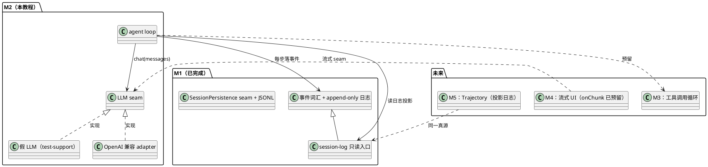
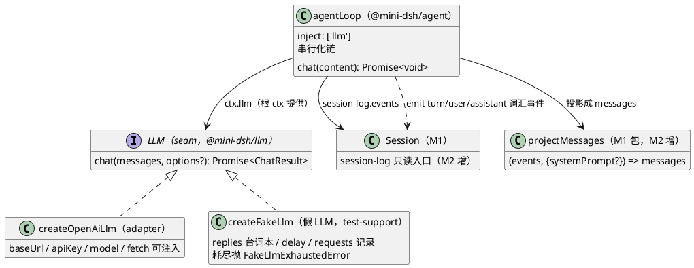
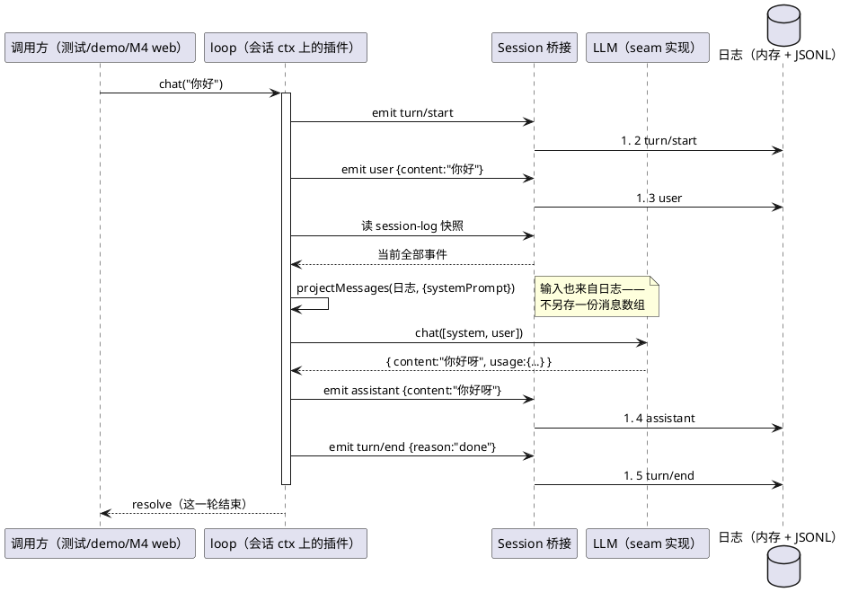

# M2 教程：seam 与假 LLM —— agent loop 怎么驱动会话

> 读者：AI 编程小白，只需要会基础 TypeScript 和命令行。全部练习**零 API key** 可跑。
> 前置：M0（ctx、服务、事件、插件）、M1（事件日志与真源）。本教程代码在
> `packages/llm/`、`packages/agent/`、`packages/test-support/`，演示命令 `pnpm demo:agent`。

## 1. 动机：日志有了，谁来写它

M1 把"会话是什么"定死了：一段 **append-only 事件日志**（`turn/start → user → assistant → turn/end`）。
但 M1 里的日志是**手工 emit 出来的**——演示脚本一条条往日志里塞事件。这显然不是真系统。

真系统里，这些事件应该由**一个东西自动产生**：用户发消息 → 系统开始一轮 → 调模型 → 模型回复 →
一轮结束。这个东西就是 **agent loop（智能体循环）**。它是全仓库**唯一**允许写"拿输入→调模型→写输出"
循环的地方（requirements §2.5 硬约束）：未来加工具（M3）、加审批、加上下文压缩，全部从预留的
**seam（接缝）**挂进来，loop 本身不再改。

M2 还带来第二件事：**模型从哪来**。测试不能真调 DeepSeek API（慢、花钱、不可复现），所以先定义
**LLM seam**（模型长什么样的抽象契约），再给两个实现：

- **假 LLM**（测试实现）：一本"台词本"，按预设顺序吐回复，零 key、零网络；
- **OpenAI 兼容 adapter**（生产实现）：真调 API，DeepSeek/Ollama/vLLM 通用。

M2 在整个系统里的位置：



## 2. 设计：M2 做了什么

### 2.1 全景（类图）



**读图顺序**：loop 不直接认识任何具体模型——它只认识 `LLM` 接口（seam）。生产装配装 adapter，
测试装配装假 LLM，装配方式都是 `ctx.plugin(...)`（"连假模型也是一个插件"）。loop 的输出走
M1 的事件词汇落日志，输入从日志投影——**输入输出都对着同一个真源**。

### 2.2 一轮对话的完整时序



三个要点：

1. **`turn/start` 和 `user` 都是 loop 自己 emit 的**。调用方只投喂内容，不碰轮次边界——
   这是 M2 对 spec 里"监听 user 事件"预拍板方案的修订（原因见 §4.5），也贴合原版
   deepseek-harness 的做法：驱动器认领会话、先打开轮次、再领取输入。
2. **模型输入来自日志投影**：loop 每轮现读 `session-log` 快照，用 `projectMessages`
   把 `user`/`assistant` 事件映射成消息数组（其余事件跳过，system prompt 拼头部）。
3. **崩溃路径**：`llm.chat` 抛错 → emit `turn/end {reason:'crash'}` → 原错误向上抛给调用方。
   M1 的崩溃恢复补的正是这条记录的同款 `reason`——两处词汇闭环。

### 2.3 OpenAI 兼容 adapter 请求的形状

```
POST https://api.deepseek.com/chat/completions
Authorization: Bearer <key>            ← 本地端点（Ollama/vLLM）不提供 key 时不带这行
Content-Type: application/json
{ "model": "deepseek-chat", "messages": [...], "stream": false }
```

响应解析：`choices[0].message.content` → 回复内容；`usage.prompt_tokens / completion_tokens` →
token 用量（M5 Trajectory 检查器的数据来源）。HTTP 层 `fetch` 可注入——**测试注入假端点，
零 key 不真调 API**。

## 3. 新概念（第一次出现，从零解释）

### 3.1 seam（接缝）

软件里"换掉一个零件而不用改其他代码"的边界。M1 见过第一个：`SessionPersistence`（换存储后端）。
M2 是第二个：`LLM`。seam 的一侧是**抽象契约**（`chat(messages) → { content, usage }`），另一侧是
**任意多个实现**（adapter、假 LLM、将来的本地模型注册表）。实现之间可以互相替换，是因为
**消费方只 import 契约，从不 import 实现**。

### 3.2 adapter（适配器）

把"A 的接口"翻译成"B 的接口"的代码。这里的 adapter 把 `LLM` 契约翻译成 OpenAI 兼容 HTTP 协议
（`/chat/completions`）。DeepSeek 官方 API 就是 OpenAI 兼容协议，所以**一个 adapter 通吃**
DeepSeek/Ollama/vLLM——换端点只换插件的 `baseUrl`/`model`，loop 一行不改。

### 3.3 agent loop（智能体循环）

"拿输入 → 调模型 → 写输出"的循环。它是 harness 的心脏，也是全仓库**唯一**允许存在这种循环的
地方（未来一切能力都从 seam 挂进来，不改 loop）。M2 的 loop 是单轮串行版：一轮 = 4 条日志事件
+ 1 次模型调用。

### 3.4 system prompt（系统提示词）

拼在消息数组**最前面**的一条"设定"消息（`role: 'system'`），告诉模型"你是谁、什么风格"。
它不属于对话内容，但每轮都随历史一起发给模型。M2 只支持一条可配置字符串；工具描述注入是
M3 的事（也拼在这条后面）。

### 3.5 上下文（context）与上下文窗口

发给模型的**全部输入**（system prompt + 历史问答 + 当前问题）叫"上下文"；模型一次能接受的
上下文有长度上限（token 数），叫"上下文窗口"。M2 把整个日志投影全量发出去——会话越长上下文
越长，直到顶到窗口（那时就需要 compaction 压缩，backlog 第 8 项）。M2 刻意不做压缩：先把
"上下文 = 日志投影"这条铁律立起来。

### 3.6 投影（projection）第一次落地

M1 预告过投影但没实现。M2 落地第一个：`projectMessages`——从日志里**过滤+变形**出模型消息
（user/assistant 事件按序映射、其余跳过）。投影不复制数据、不另立真源：它是日志的一个
"取景框"。M5 的 Trajectory 视图是同一真源上的另一个取景框。

### 3.7 服务注入链 + inject

M0 见过"服务"（ctx 上的命名对象）。M2 展示了**链式注入**的完整样子：

- 根 ctx 上装 `provideLlm`/`openAiLlm` 插件 → 提供 `llm` 服务；
- `openSession` 让会话 ctx **继承**根的服务（ctx 沿原型链找服务）；
- loop 插件声明 `inject: ['llm']` —— cordis 会**等到服务就绪**才装载它，setup 里就能用
  `ctx.llm` 取到（SessionManager 的 `static inject` 同款机制）。

"换 provider = 换提供服务的插件"：demo 换成假 LLM，生产换成 `openAiLlm`，loop 一模一样。

## 4. 取舍（tradeoff）与理由

### 4.1 为什么 loop 的输入也读日志（不另存一份消息数组）

最省事的做法是 loop 自己维护一个 `messages: ChatMessage[]`，每轮往里 push。**问题**：消息数组
成了第二个真源，一旦和日志不一致（某条写了一半、某种事件忘了同步），resume 后模型看到的
历史和日志对不上，极难排查。读日志投影则**不可能不一致**——只有一份数据。代价是每轮要读一次
日志+投影（M2 规模下微秒级，可以忽略）。

### 4.2 为什么先非流式（流式留给 M4）

流式（逐字吐字）体验好，但要求 seam、loop、UI 三层同时支持。M2 的目标是"loop 正确驱动一轮"，
一次只加一个复杂度。seam 上已留好缝：`ChatOptions.onChunk`（增量回调）**只声明不调用**——M4
接 UI 时用同一个 seam 消费增量，M2 的代码不用改契约。

### 4.3 为什么 adapter 走 OpenAI 兼容协议，而不是 DeepSeek 专有协议

DeepSeek API 本身就是 OpenAI 兼容协议（`/chat/completions` + messages 数组），Ollama、vLLM
等本地端点也都提供这个协议。写一个"OpenAI 兼容 adapter"= 同时支持全部这些端点；
写 DeepSeek 专有协议反而把自己锁死。这是"可扩展性优先于功能完整"（requirements §2.5）在
LLM 上的具体体现。

### 4.4 为什么假 LLM 必须记录收到的请求（可观测性）

假 LLM 不只是"回台词"，还记录每次调用收到的 messages（`fake.requests`）。没有这个窗口，
"模型到底看到了什么"就无从断言——loop 错把两条历史拼反了，测试照样全绿。**可观测性不是
附带品，是 seam 测试的前提**：demo 里打印的"模型看到的 messages"和练习 4 的精确断言，
都靠这个窗口。

### 4.5 为什么 loop 是"服务入口"，而不是"监听 user 事件"（spec 修订记录）

M2 spec 的预拍板写的是"loop 监听会话 ctx 的 user 事件"。开工核对时发现矛盾：M1 约定日志顺序
是 `turn/start → user → ...`，而 Session 桥接在会话打开时就同步注册了监听——外部 emit `user`
后 loop 再反应，`turn/start` 必然排在 `user` **之后**，顺序无法满足。修订为：调用方调
`loop.chat(content)`，由 loop 自己 emit `turn/start` 与 `user`（原版同款："驱动器先打开轮次、
再领取输入"）。修订已记入 notes。

## 5. 小白看这份代码，按什么顺序读

1. `packages/llm/src/llm.ts` —— seam 本体：三四个小接口 + `onChunk` 预留。先读懂"契约"
   长什么样（10 分钟以内）。
2. `packages/test-support/src/fakellm.ts` —— 假 LLM：台词本、记录、耗尽抛错。对照
   `tests/fakellm.test.ts` 看每行的"为什么"。
3. `packages/llm/src/openai.ts` —— adapter：请求组装 + 响应解析 + 错误传播。对照
   `packages/llm/tests/adapter.test.ts` 里的"假 HTTP 端点"看它怎么被测试。
4. `packages/llm/tests/contracts/llm-contract.ts` —— seam 契约套件：两个实现都要过的关。
5. `packages/session/src/project.ts` —— 日志投影；`packages/session/src/session.ts` 构造器里
   grep `session-log` —— 日志的只读入口（注意注释：为什么用 defineProperty 而不用 provide）。
6. `packages/agent/src/loop.ts` —— 主角：一轮 60 行。先读 `chat()` 的串行化链，再读
   `runTurn()` 的五个动作，最后读 `inject` 与 `defineProperty` 两处注释。
7. `packages/agent/tests/loop.test.ts` → `tests/e2e.test.ts` —— 从单元到端到端，看"输入读
   日志"与"重启后历史完整"怎么被钉死。
8. `packages/agent/examples/chat-demo.ts` —— 跑一遍，输出即 2.2 时序图的文字版。

## 6. 动手练习（零 API key）

### 步骤 0：准备（第一次来才需要）

```sh
pnpm install
```

### 步骤 1（主练习）：跑通三幕演示

```sh
pnpm demo:agent --clean
```

对照 §2.2 读懂输出：第一幕一轮（`turn/start → user → assistant → turn/end`）；第二幕同进程
第二轮（模型输入多了第一轮的问答）；第三幕"重启"后 resume（新台词本，模型输入是全量历史）。
再跑一次并注意：`--clean` 清目录后是**新会话 id**，而历史依然完整——append-only 的直觉。

### 步骤 2：换台词本，看日志怎么变

编辑 `packages/agent/examples/my-script.ts`（代码见附录），把开头的 `SCRIPT_1` / `SCRIPT_2`
改成你自己的台词，例如：

```ts
const SCRIPT_1 = ['我是被换过的第一句台词。', '我是被换过的第二句台词。']
const SCRIPT_2 = ['重启后我也换台词啦。']
```

```sh
pnpm tsx packages/agent/examples/my-script.ts /tmp/m2-practice
```

验收标准：输出里 `assistant` 事件的内容跟着你的台词变；"重启后 resume"的那一轮，模型输入
包含重启前的**全部**问答（来自日志投影）。

### 步骤 3：加一轮对话，验证 resume 后续聊

给 `my-script.ts` 第二段进程再加一次 `loop2.chat('第四问')`，同时给 `SCRIPT_2` 补一句台词，
再跑一次。验收标准：日志变成 4 轮（16 条 + 头记录），第四轮的模型输入含前三轮全部内容。

### 步骤 4（进阶）：断言"模型收到的 messages"精确内容

```sh
pnpm vitest run packages/agent/tests/my-messages.test.ts
```

看绿。然后把测试里 `REPLIES` 的第二句改成 `'另一种回答'`，**再跑一次——测试变红**（假 LLM
真的按台词本回答，日志里的 assistant 内容变了）。这就是 TDD 的 RED：测试先于实现立规矩。
最后把第 3 条断言的期望值改成你的新答案，回绿。

验收标准：你亲眼看到同一个测试**红→绿**各一次，并说得出"红"是因为日志内容变了而不是
代码坏了。

## 7. 常见问题

**Q：为什么 loop 句柄要从 `fiber.ctx['agent-loop']` 拿，而不是 `session.ctx`？**
`ctx.plugin` 会给插件一个**会话 ctx 的子 ctx**（插件自己的 fiber 作用域），loop 句柄挂在那个
ctx 上。这也是"插件有自己的作用域"的第一课：装在会话上的插件，不等于直接往会话 ctx 上
贴属性。

**Q：为什么 `agent-loop` 用 defineProperty，而 `llm` 用 provide？**
cordis 的 `provide` 服务键按**根 ctx 作用域唯一**：同一 runtime 下两个并存会话各自 provide
`agent-loop` 会撞键（M1 的 `events`、M2 的 `session-log` 同款坑）。`llm` 是根 ctx 上一个
全局服务，provide 正合适；`agent-loop` 是每会话一个的实例，用自有属性遮蔽。

**Q：假 LLM 回复用尽会怎样？**
抛 `FakeLlmExhaustedError`（含"第几次调用"）。这是刻意的：**防静默空转**——如果耗尽后返回
空字符串，loop 会照样落一条空 `assistant`，测试可能在一片寂静中通过。

**Q：真接 DeepSeek API 要改哪里？**
只改装配，一行 loop 都不用动：

```ts
await ctx.plugin(openAiLlm, { apiKey: process.env.DEEPSEEK_API_KEY, model: 'deepseek-chat' })
```

**Q：loop 崩了，会话还能恢复吗？**
能。崩溃路径落 `turn/end {reason:'crash'}` 后错误向上抛；即使进程直接死掉没落这条，
M1 的 `repairDanglingTurn` 也会在下次 resume 时补上（两处词汇闭环）。

## 8. 小结

- **LLM seam**：`chat(messages) → { content, usage }`，`onChunk` 为 M4 流式预留；
  两个实现（OpenAI 兼容 adapter + 假 LLM）都通过同一份契约测试。
- **agent loop 是全仓唯一具体循环**：一轮 = `turn/start → user → 投影 → llm.chat →
  assistant → turn/end`，每步落日志；崩溃落 `turn/end {reason:'crash'}` 并上抛。
- **输入也读日志**：session-log 快照 → `projectMessages` 投影——真源的双向验证，
  resume 后历史天然完整。
- **换 provider = 换插件**：`inject: ['llm']` 声明依赖，根提供、会话消费。
- 下一步 M3：工具调用循环登场——它挂在 loop 的 assistant 与 turn/end 之间，
  loop 本身一行不改（这正是 M2 把循环收拢成唯一的原因）。

## 附录：练习脚本全文

`my-script.ts`（仓库路径 `packages/agent/examples/my-script.ts`）：

```ts
/**
 * M2 教程练习脚本：给假 LLM 换台词本，看日志与"模型看到的 messages"怎么变。
 *
 * 练习任务（docs/tutorials/M2-llm-and-loop.md §6 步骤 2/3）：
 *   1) 修改下方 SCRIPT_1 / SCRIPT_2 的台词；
 *   2) 运行：pnpm tsx packages/agent/examples/my-script.ts
 *   3) 观察输出：assistant 事件内容跟着台词变；"重启"后 resume 的那一轮，
 *      模型输入里出现重启前的全部问答（历史来自日志投影，不是内存里的数组）。
 *
 * 用法：pnpm tsx packages/agent/examples/my-script.ts [目录]
 *   默认目录 ./.mini-dsh/sessions
 */
import { mkdir } from 'node:fs/promises'
import { resolve } from 'node:path'
import { Context } from 'cordis'
import { jsonlPersistence, SessionManager } from '@mini-dsh/session'
import type { Session, SessionEvent } from '@mini-dsh/session'
import { provideLlm } from '@mini-dsh/llm'
import { createFakeLlm } from '@mini-dsh/test-support'
import { agentLoop } from '@mini-dsh/agent'
import type { AgentLoop } from '@mini-dsh/agent'

// ↓↓↓ 练习：改这两份台词本 ↓↓↓
const SCRIPT_1 = ['第一句台词（第一轮回复）', '第二句台词（第二轮回复）']
const SCRIPT_2 = ['重启后的台词（第三轮回复）']
// ↑↑↑ 练习：改这两份台词本 ↑↑↑

const dir = resolve(process.argv[2] ?? '.mini-dsh/sessions')

function render(events: readonly SessionEvent[]): string {
  return events
    .map((e) => `  #${String(e.seq).padStart(2)} ${e.type.padEnd(16)} ${JSON.stringify(e.payload ?? '')}`)
    .join('\n')
}

async function boot(script: string[]) {
  await mkdir(dir, { recursive: true })
  const ctx = new Context()
  await ctx.plugin(jsonlPersistence, { dir })
  await ctx.plugin(SessionManager)
  const fake = createFakeLlm({ replies: script.map((content) => ({ content })) })
  await ctx.plugin(provideLlm, fake)
  return { ctx, manager: ctx.get('session-manager')!, fake, stop: () => ctx.fiber.dispose() }
}

async function attachLoop(session: Session): Promise<AgentLoop> {
  const fiber = await session.ctx.plugin(agentLoop, { systemPrompt: '你是教学助手，回答简短。' })
  return fiber.ctx['agent-loop']
}

async function main(): Promise<void> {
  // ---- 第一段进程：聊两轮 ----
  const first = await boot(SCRIPT_1)
  const s1 = await first.manager.create({ title: 'M2 练习' })
  const loop1 = await attachLoop(s1)
  await loop1.chat('第一问')
  await loop1.chat('第二问')
  await s1.flush()
  console.log('===== 第一段进程（聊两轮）=====')
  console.log(`${render(s1.log)}\n`)
  console.log('第二轮模型看到的 messages：')
  for (const m of first.fake.requests[1]!.messages) console.log(`  [${m.role.padEnd(9)}] ${m.content}`)
  console.log()
  const id = s1.id
  await first.stop()

  // ---- 第二段进程：重启，resume 后续聊 ----
  const second = await boot(SCRIPT_2)
  const s2 = await second.manager.resume(id)
  const loop2 = await attachLoop(s2)
  await loop2.chat('第三问')
  await s2.flush()
  console.log('===== 重启后 resume（第三轮）=====')
  console.log(`${render(s2.log)}\n`)
  console.log('第三轮模型看到的 messages（历史来自日志投影）：')
  for (const m of second.fake.requests[0]!.messages) console.log(`  [${m.role.padEnd(9)}] ${m.content}`)
  await second.stop()
}

main().catch((error) => {
  console.error(error)
  process.exit(1)
})
```

`my-messages.test.ts`（仓库路径 `packages/agent/tests/my-messages.test.ts`）：

```ts
import { describe, expect, it } from 'vitest'
import { createFakeLlm, createTestContext } from '@mini-dsh/test-support'
import { openSession } from '@mini-dsh/session'
import { provideLlm } from '@mini-dsh/llm'
import { agentLoop } from '@mini-dsh/agent'

/**
 * M2 教程练习（docs/tutorials/M2-llm-and-loop.md §6 步骤 4）：
 * 断言"模型收到的 messages"精确内容 —— 假 LLM 的 requests 记录是观测窗口。
 */
describe('M2 教程练习：断言模型收到的 messages', () => {
  it('两轮对话：第二轮输入 == 第一轮问答 + 新问题', async () => {
    const REPLIES = ['第一轮回答', '第二轮回答']
    const { ctx, dispose } = await createTestContext()
    const fake = createFakeLlm({ replies: REPLIES.map((content) => ({ content })) })
    await ctx.plugin(provideLlm, fake)
    const session = await openSession(ctx, { id: 'my', meta: { id: 'my', title: '', createdAt: 0 } })
    const fiber = await session.ctx.plugin(agentLoop)
    const loop = fiber.ctx['agent-loop']
    try {
      await loop.chat('第一问')
      await loop.chat('第二问')

      expect(fake.requests[0]!.messages).toEqual([{ role: 'user', content: '第一问' }])
      expect(fake.requests[1]!.messages).toEqual([
        { role: 'user', content: '第一问' },
        { role: 'assistant', content: '第一轮回答' },
        { role: 'user', content: '第二问' },
      ])
      expect(session.log.map((e) => e.type)).toEqual([
        'session/created',
        'turn/start',
        'user',
        'assistant',
        'turn/end',
        'turn/start',
        'user',
        'assistant',
        'turn/end',
      ])
    } finally {
      await dispose()
    }
  })
})
```
