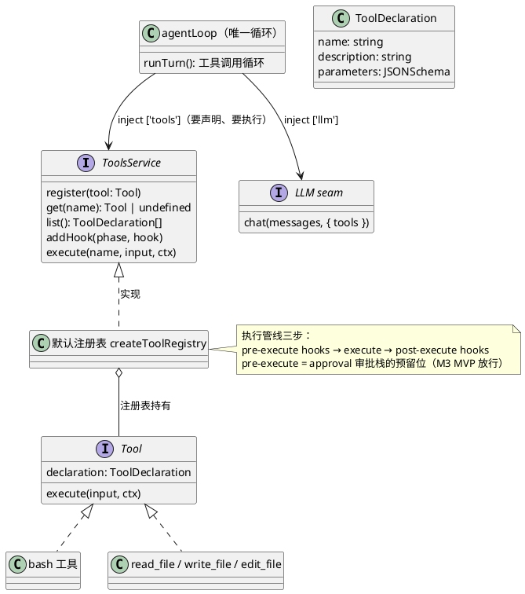
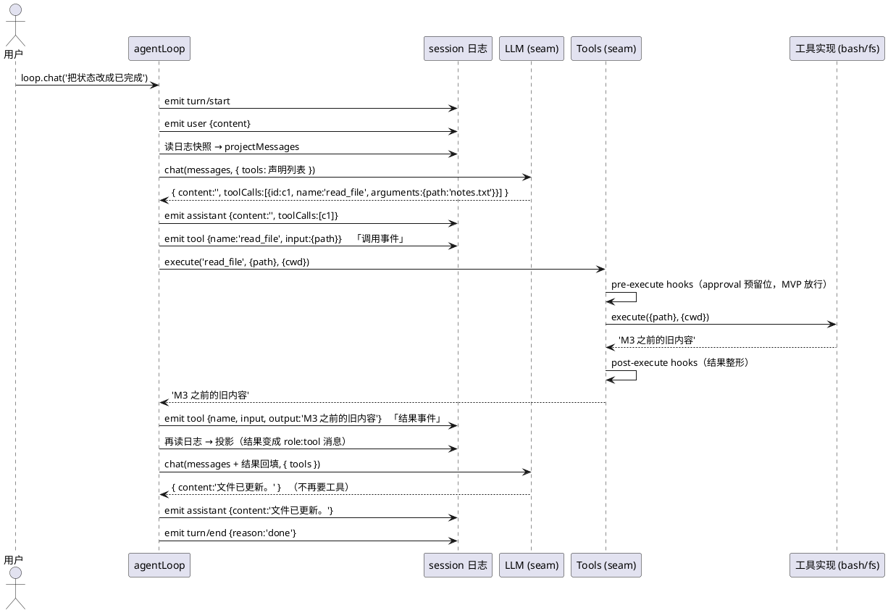

# M3 教程：工具与工具循环 —— 模型怎么"动手"

> 面向 AI 编程小白。读完 M0–M2 教程（或跑过 `pnpm demo:agent`）后开始。本文所有命令
> **零 API key** 可跑，全部由假 LLM 台词本驱动。

M2 结束时，我们的 agent 只会"说"：一轮对话 = `turn/start → user → assistant → turn/end`，
模型输出永远只是文字。但真实的编程助手要会"做"：读文件、改代码、跑命令。M3 给它装上
**手脚**：一个 Tools seam（工具注册表 + 执行管线）+ 四个真工具（bash、文件读/写/编辑）+
loop 里的**工具调用循环**。从此模型可以说"我要读这个文件"，然后文件真的被读了，结果
回到模型手里，模型再决定下一步——每一步都落在 M1 定义的事件日志里。

## 1. 动机：模型只会说，怎么办

### 1.1 问题：文字回答解决不了"动手"任务

在 M2 的 loop 里，模型被问"帮我把 notes.txt 里的状态改成已完成"，它只能回答：

> 好的，你可以打开编辑器把"未完成"改成"已完成"。

它"知道"答案，但动不了手——因为 loop 只会把它的文字写进 `assistant` 事件，没有任何
通道能让它真正操作文件。

### 1.2 解法：把"能力"做成工具，把"选择"留给模型

M3 的思路（也是原版 DeepSeek Harness 的思路）：

1. **工具 = 声明 + 实现**。声明（名字、说明、参数 schema）告诉模型"有什么能力可用"；
   实现（`execute`）是真正动手的代码。两者分开：模型只看见声明，执行只认注册表。
2. **loop 装上循环**。模型回复里如果带着 `tool_calls`（"我要用工具"），loop 就逐个执行、
   把结果**回填**给模型、再问一次——直到模型给出纯文字回答，或达到步数上限。
3. **每个动作都落日志**。要工具、执行完拿到结果，都是 `tool` 事件——Trajectory（M5）
   回放的不再只有聊天，还有模型"动手"的全过程。

### 1.3 为什么排在 M3（依赖关系）

| 前一个 M | 给 M3 留下了什么 |
|---|---|
| M1 | `tool` 事件词汇（当时"定义了但没人用"）；append-only 日志 |
| M2 | LLM seam（工具协议走同一个 `chat`）；loop 的挂点（assistant 之后、turn/end 之前）；假 LLM 预留的"工具调用序列"接口位 |

反过来，M4 的 tool 卡片直接渲染 M3 落的 `tool` 事件；M5 的 Trajectory 检查器读 `tool`
事件的 input/output。**工具事件是轨迹灵魂的一半**——没有它，轨迹只是聊天记录。

## 2. 设计：M3 做了什么

### 2.1 全景（类图）



三个包的分工：

- `packages/tools` —— Tools seam（第三个 seam）+ 四个工具实现；
- `packages/llm` —— 工具调用协议（`tools` / `tool_calls` / `role:'tool'`）的 wire 转换；
- `packages/agent` —— loop 里的工具循环（全仓唯一的具体循环逻辑，M2 的增量）。

### 2.2 一次工具往返的完整时序



注意中间那步"**再读日志 → 投影**"：loop 在循环内部也不自己攒消息数组，而是每步从
`session-log` 重新投影——M2 的"输入读日志"原则延伸到循环内部。工具结果能进入下一步的
模型输入，完全是因为它先落进了日志。

### 2.3 事件 ↔ 模型消息的映射（投影规则）

| 日志事件 | 载荷 | 投影成模型消息 |
|---|---|---|
| `turn/start`、`turn/end`、`session/created` | — | 跳过 |
| `user` | `{content}` | `{role:'user', content}` |
| `assistant` | `{content, toolCalls?}` | `{role:'assistant', content, toolCalls?}` |
| `tool`（调用，无 output） | `{name, input}` | **跳过**（结果还没回来，模型不能看到半截） |
| `tool`（结果，有 output） | `{name, input, output}` | `{role:'tool', toolCallId: 配对 id, content: JSON.stringify(output)}` |

`toolCallId` 怎么配对？M3 单步单个工具**串行**执行，所以"最近的 assistant 消息里的
toolCalls，按顺序对应后面的结果事件"。轨迹里调用/结果两条 `tool` 事件是相邻的，M5 的
检查器也靠这个结构区分"要了什么"与"得到了什么"。

### 2.4 工具调用协议的消息形状（OpenAI 兼容）

模型要工具时，`chat` 返回的不再是纯文字：

```jsonc
// 返回（seam 内部形状，arguments 已是对象）
{ "content": "", "toolCalls": [{ "id": "c1", "name": "read_file", "arguments": { "path": "notes.txt" } }] }

// adapter 发给 API 的 wire 形状（arguments 是 JSON 串）
{ "role": "assistant", "content": "", "tool_calls": [
  { "id": "c1", "type": "function", "function": { "name": "read_file", "arguments": "{\"path\":\"notes.txt\"}" } }
]}

// 结果回填给模型的 tool 消息（wire 形状）
{ "role": "tool", "tool_call_id": "c1", "content": "\"M3 之前的旧内容\"" }
```

## 3. 新概念（第一次出现，从零解释）

### 3.1 工具调用协议（tool_calls 与 tool 消息）

**工具调用协议**是 OpenAI 兼容 API 里"模型与工具协作"的约定，四个部分：

- **`tools` 参数**：请求里附带"我有哪些工具"（名字 + 描述 + 参数 schema）；
- **`tool_calls`**：模型回复里说"我要调用这些工具"，每个调用带一个 `id`；
- **`role:'tool'` 消息**：结果消息，用 `tool_call_id` 指明"这是哪个调用的结果"；
- **回填**：下一轮请求把 assistant（带 tool_calls）和 tool（结果）消息一起发给模型。

关键直觉：模型不"执行"工具，它只**提名**调用；执行是 harness 的事。协议用 `id` 把
"提名"和"结果"缝在一起。

### 3.2 函数 schema（JSON Schema）

工具的 `parameters` 字段是一份 **JSON Schema**——给模型看的"参数说明书"：

```ts
{
  type: 'object',
  properties: { command: { type: 'string' }, cwd: { type: 'string' } },
  required: ['command'],
}
```

模型读到它就知道"调用 bash 时必须给 `command`，可选 `cwd`"。声明写得越清楚，模型调用
越准——这是 prompt engineering 之外的另一种"调教"：**schema 就是工具的使用说明**。

### 3.3 执行管线与 hook

工具不是"找到实现就调用"这么简单，而是走一条**管线**：

```
pre-execute hooks → execute（工具实现） → post-execute hooks
```

- **pre-execute**：执行前。M3 的 MVP 没有 hook = 直接放行。这里就是未来**审批栈**的
  挂点（backlog #2）：要跑 `rm -rf` 时，审批插件往这里挂一个 hook 抛拒绝即可，管线、
  loop、工具全都零改动。
- **post-execute**：执行后。hook 的返回值替换输出——"结果整形"（比如统一包一层
  `{ok, data}`）。返回 `undefined` 表示不改。

hook 是"能力扩展点"的教科书例子：**扩展功能时加的是 hook，不是 if 语句**。

### 3.4 工具结果回填（role:tool 消息）

工具执行完，结果不是存到某个"工具结果变量"里，而是变成一条 `role:'tool'` 消息，
**拼进下一次模型调用的 messages**。这是 M3 的重要取舍（见 §4.4）：模型的"工作记忆"
只有 messages 这一个地方。

### 3.5 maxSteps（循环上界）

模型如果每次都只要工具不要文字，循环就停不下来。`maxSteps`（默认 8，一次工具执行算
一步）给循环装上界：超限 → 落 `turn/end {reason:'limit'}` → 抛 `MaxStepsExceededError`。
**不静默空转**：上限触达是可观测的（日志 + 异常），M5 的轨迹检查器能一眼看到
"这轮是因为没完没了被掐断的"。

### 3.6 exit code 是输出不是异常

bash 工具执行 `exit 3` 时**不抛错**，而是返回 `{stdout, stderr, exitCode: 3}`。为什么？
因为模型需要看到"失败原因"（stderr + 退出码）来决定下一步，而不是收到一个笼统的
"工具炸了"。规则：**命令跑完了（哪怕退出码非零）就是成功的结果；进程起不来（如 cwd
不存在）才是异常**。同理 read/edit 对"文件不存在"是报错（读不到就是读不到），而
write 会自动建父目录（工具要能"建新东西"）。

### 3.7 会话 cwd（工具的工作目录）

工具按什么目录解析相对路径？答案是**会话 meta 里的 `cwd`**：`SessionManager.create`
时记进 JSONL 头记录（M1 的头记录天然兼容这个新字段），loop 从会话 ctx 的
`session-meta` 取到后放进执行上下文；旧会话没有该字段时用进程 cwd 兜底。一个会话绑定
一个工作目录——这就是"agent 在哪个项目里干活"的最小表示。

## 4. 取舍（tradeoff）与理由

### 4.1 为什么不做审批栈，但 hook 位先留好

MVP 目标是跑通"模型动手"的教学闭环，审批/权限栈（backlog #2）会引入用户交互、策略、
UI 一大坨复杂度。但**扩展点先留好**：pre-execute hook 就是审批栈的精确挂点，未来加审批
= 加一个 hook 插件。原则（requirements §2.5）：可扩展性优先于功能完整，预留成本极低
（一个数组 + 一段循环），事后补成本极高（改 loop、改 seam、改所有测试）。

### 4.2 为什么一次工具调用落两条事件

调用（只有 input）与结果（带 output）**分成两条 `tool` 事件，中间隔着执行**。代价是
日志多一条、投影多一个分支；收益是：

- 轨迹检查器能区分"模型要了什么"与"实际得到了什么"；
- 崩溃发生在执行中时，日志如实留下"要了工具、没等到结果"的痕迹（M1 的断尾修复精神）；
- M5 的 Trajectory 视图天然有"调用卡片"与"结果卡片"两个展示点。

### 4.3 为什么 bash 无沙箱（教学版，风险明示）

真实的 agent 平台会沙箱化工具执行。教学版**不设沙箱**：模型要 `rm -rf ~` 就真会执行。
理由：①沙箱（容器/权限隔离）是平台工程，不是本项目的教学主题；②风险点正是教学点——
轨迹里每一行都是"模型干过什么"的证据，学生自己跑 demo 时对"无审批"的风险有切身体感。
**README 与本文都明示此风险**；未来接审批栈时，风险闭环在 §4.1 的 hook 位。

### 4.4 为什么工具结果回填 messages，而不是"记住在别处"

备选方案：harness 内部维护一份"工具结果表"，每次调模型时单独拼上。否决理由：
①模型的历史本来就是 messages，回填后**整段历史自洽**——resume 重启后只要重新投影日志，
工具往返自动复原，不需要"结果表"跟着持久化；②与 M2 的"输入读日志"同一原则：日志是
唯一记忆，一切从它投影。代价：messages 会长一点（结果以 JSON 文本进入上下文）。

### 4.5 为什么 seam 里 arguments 是对象，JSON 串归 adapter 管

OpenAI 协议里 `tool_calls[].function.arguments` 是 **JSON 字符串**。但 seam（LLM 契约）
把它定义成**已解析对象**：loop 和工具只跟对象打交道，不关心线格式；adapter 独占
"对象 ↔ JSON 串"的转换（含非法 JSON 回退 `{}`）。这是 seam 的一贯哲学：**协议细节
关在实现里，消费方只见干净的契约**。代价：adapter 多十几行转换代码。

### 4.6 为什么工具声明走协议的 tools 参数，不拼进 system prompt

工具描述可以有两种进模型的方式：拼进 system prompt（文字描述），或走协议的 `tools`
参数（结构化声明）。选后者：①结构化声明对模型更可靠（schema 有类型、有 required）；
②不占用 system prompt 的 token；③声明列表由 tools seam 动态生成——注册了什么工具，
模型自动看到什么，**注册新工具零 prompt 改动**。

## 5. 小白看这份代码，按什么顺序读

从"测试替身"读到"真实现"，再读到"组合点"：

1. **`packages/test-support/src/fakellm.ts`**（~120 行）——假 LLM 的台词本怎么预设
   `toolCalls`、怎么记录每次请求的 `tools` 与 messages。这是后面所有测试的观测窗口。
2. **`packages/tools/src/tools.ts`**（~140 行）——Tools seam 本体：`ToolDeclaration` /
   `Tool` / `ToolsService`；重点读 `execute` 的三段管线（pre hooks → execute → post
   hooks），以及 `ToolDeniedError` 的注释。
3. **`packages/tools/src/bash.ts` + `fs.ts`**（~180 行）——四个工具实现。重点看 bash
   怎么把"非零退出码"变成正常返回值（`typeof failed.code === 'number'` 那个分支），
   和 edit 怎么要求"恰好一次"。
4. **`packages/llm/src/openai.ts`**（新增 ~60 行）——`toWireMessage`（对象 arguments →
   JSON 串）与 `parseToolCalls`（JSON 串 → 对象，非法回退 `{}`）。对照 §2.4 的表格读。
5. **`packages/session/src/project.ts`**——投影怎么把 tool 事件映射成 `role:'tool'`
   消息、toolCallId 怎么顺序配对（`pendingToolCalls` 数组）。
6. **`packages/agent/src/loop.ts`**——主角：`runTurn` 里的 `for(;;)` 循环。对照 §2.2
   时序图逐行读：assistant 带 toolCalls 时怎么逐条落两个 tool 事件、怎么每步重投影、
   maxSteps 在哪检查、crash/limit 两条出口怎么走。
7. **`packages/agent/tests/tool-loop.test.ts` + `tool-e2e.test.ts`**——契约测试与真工具
   端到端（e2e 里的"文件真的被改了"断言是 M3 的最终证据）。
8. **`packages/agent/examples/tools-demo.ts`**——零 key demo，跑一遍再看代码。

## 6. 动手练习（零 API key）

### 步骤 0：准备（第一次来才需要）

```bash
pnpm install        # 首次需要；之后跳过
pnpm test           # 确认 150 个测试全绿
```

### 步骤 1（主练习）：跑通工具 demo

```bash
pnpm demo:tools --clean
```

看输出里的三件事：①日志里 `tool` 事件成对出现（调用/结果）；②模型三次调用的 messages
逐步变长——第二次有了 read 的结果，第三次有了全部两次往返；③最后打印的 notes.txt
真的从"未完成"变成了"已完成"。**验收标准：你能指着输出说出哪条事件是"模型要工具"，
哪条是"工具干完活"。**

### 步骤 2：改剧本，看文件与日志怎么变

打开 `packages/agent/examples/my-tools.ts`，找到"练习区 1"的 `SCRIPT`，把 edit_file 的
`newText` 从 `'已完成'` 改成 `'搞定'`（三处台词里的文字也顺手改成「搞定」）：

```bash
pnpm tsx packages/agent/examples/my-tools.ts
```

观察：最终回答变了、磁盘文件变成"状态 = 搞定"、日志里的 edit 调用/结果事件都带着你的
新参数。**验收标准：改一处剧本，输出与磁盘跟着变——"模型提名、工具执行、结果回填"的
闭环你亲手改了一遍。**

### 步骤 3：手写一个自定义工具，让循环跑起来

还是 `my-tools.ts`，"练习区 2"已经放了一个 `shout` 工具（文本转大写）。照着它注册一个
**你自己的工具**（比如把文本反转），然后把 `SCRIPT` 的第一段换成调用你的工具：

```ts
{ toolCalls: [{ id: 'c1', name: 'my_reverse', arguments: { text: 'hello' } }] },
```

改完注册进 registry（`registry.register(...)` 那行照抄改名字），运行看循环跑起来。
**验收标准：你的工具名出现在日志的 tool 事件里，结果以 `role:tool` 消息回到模型。**
这就是"给 agent 加能力 = 注册一个工具"——loop 一行没改。

### 步骤 4（进阶）：断言多步循环的完整事件序列（红绿翻转）

```bash
pnpm vitest run packages/agent/tests/my-tool-loop.test.ts
```

先跑一遍看绿。然后按文件注释操作：把 `EXPECTED_TYPES` 里的第二个 `'tool'` 删掉，再跑
——测试变红；加回去，回绿。**验收标准：你能解释为什么删掉一个 `'tool'` 会让断言失败**
（调用与结果必须成对，少一条就不是一次完整工具往返）。

## 7. 常见问题

**Q：模型要调用不存在的工具怎么办？**
loop 抛 `UnknownToolError`，该轮落 `turn/end {reason:'crash'}`，错误上抛给调用方。
日志里会留下：assistant（要了工具）→ tool（调用事件，**没有**结果事件）。轨迹检查器
一眼就能看出"这轮死在执行前"。

**Q：模型一次回复要多个工具（多个 tool_calls）？**
M3 逐个**串行**执行：一个调用一个执行、一对事件。并行执行是 backlog。多个调用都执行完
再问模型，结果消息按调用顺序回填。

**Q：模型编造了参数（比如 read_file 传了数字）怎么办？**
工具实现按声明取字段，取不到就是 `undefined`，执行会以报错/失败结果暴露。adapter 对
非法 JSON 的 arguments 回退空对象，不让坏参数打崩整个 loop。

**Q：工具执行卡住了（比如 bash 跑了个死循环）？**
M3 不做工具超时/取消（backlog）。教学版风险明示：别让假 LLM 剧本要 `yes` 这种命令。

**Q：resume 旧会话，cwd 从哪来？**
头记录里有 `cwd` 就用它；M1/M2 的旧会话没有该字段，loop 用进程 cwd 兜底。

**Q：`turn/end` 的 reason 为什么多了个 `limit`？**
`crash` 是"坏了"，`limit` 是"没完没了被掐断"——语义不同，轨迹检查器（M5）需要区分。
两条路径都向上抛错（调用方可见），日志都如实记录。

## 8. 小结

M3 之后，agent 从"只会说"变成"会说也会做"：

- **Tools seam**（第三个 seam）= 注册表 + 三段管线（pre-execute 是审批栈的预留位）；
- **四个真工具** = bash + 文件读/写/编辑（exit code 是输出不是异常；路径按会话 cwd）；
- **工具循环** = 模型提名 → 落 tool 调用事件 → 执行 → 落 tool 结果事件 → 结果回填
  messages → 再问，直到文字回答或 maxSteps；
- **一切落日志**：`demo:tools --clean` 输出里那 11 行事件，就是 M5 Trajectory 视图的
  全部素材。

下一个里程碑 M4 做 Web：这些事件将通过 RPC/WS 桥流到浏览器，tool 事件变成 tool 卡片，
assistant 变成流式打字机。你已经见过了"轨迹的原料"，M4 会见到它被"端到端消费"的样子。

## 附录：练习脚本核心片段

`packages/agent/examples/my-tools.ts` 的两个练习区：

```ts
// 练习区 1：模型的剧本（两次工具往返 + 最终回答）
const SCRIPT = [
  { toolCalls: [{ id: 'c1', name: 'read_file', arguments: { path: 'notes.txt' } }] },
  { toolCalls: [{ id: 'c2', name: 'edit_file', arguments: { path: 'notes.txt', oldText: '未完成', newText: '已完成' } }] },
  { content: '好，我把 notes.txt 里的「未完成」改成了「已完成」。' },
]

// 练习区 2：注册一个自己的工具（声明 + 实现）
const CUSTOM_TOOL: Tool = {
  declaration: {
    name: 'shout',
    description: '把一段文本变成全大写。',
    parameters: { type: 'object', properties: { text: { type: 'string' } }, required: ['text'] },
  },
  async execute(input: Record<string, unknown>) {
    const { text } = input as unknown as { text: string }
    return { loud: text.toUpperCase() }
  },
}
```
