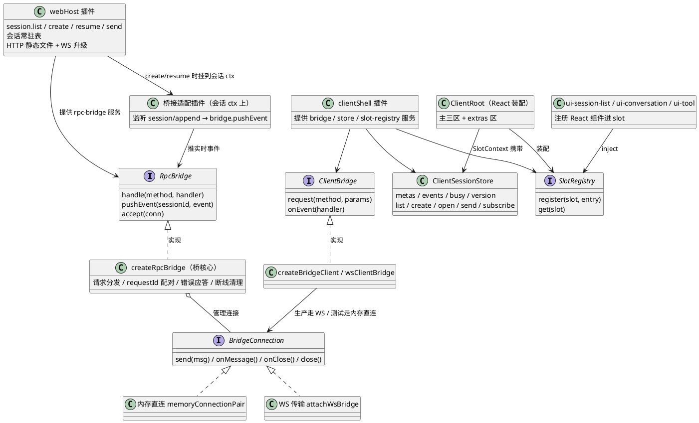
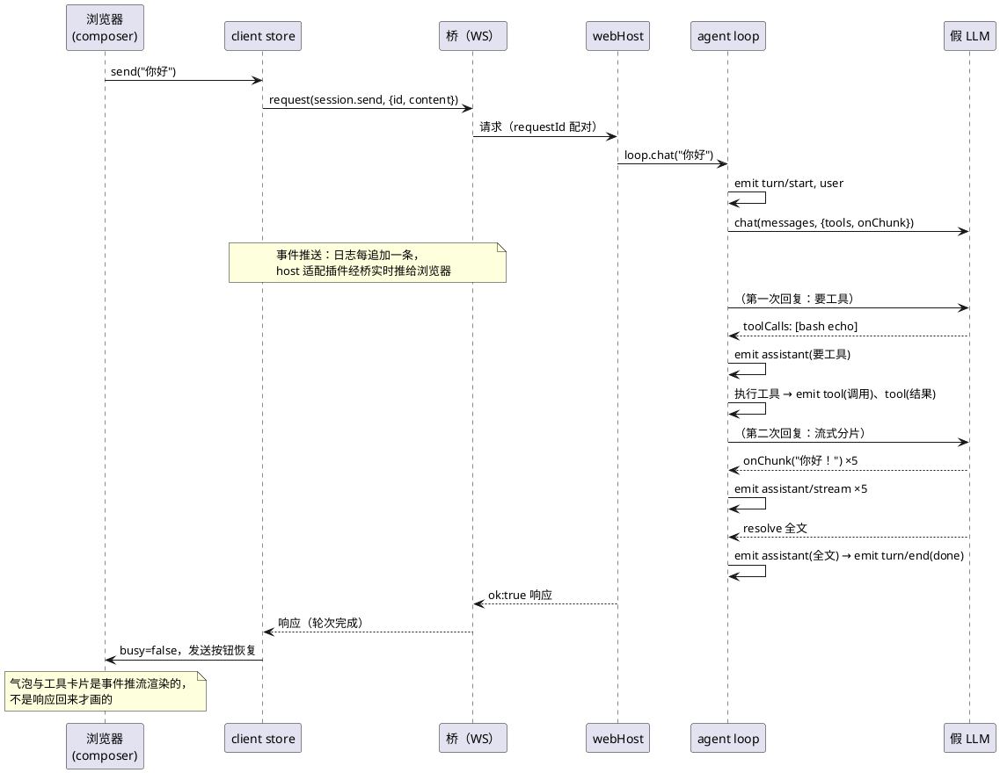

# M4 教程：Web —— 轨迹原料怎么"端到端"流到浏览器

> 面向 AI 编程小白。读完 M0–M3 教程（或至少跑过 `pnpm demo:tools`）后开始。本文所有命令
> **零 API key** 可跑，全部由假 LLM 台词本驱动。

M0–M3 攒下的东西——会话、事件日志、agent loop、工具——之前只活在 Node 进程里：
demo 把事件打印到终端，只有开发者看得见。M4 让它们**被人用起来**：一个 Web 页面，
左边是会话列表，中间是对话区（消息逐字"打字机"式出现），右边工具卡片随事件弹出。
背后的主角是一套 **host↔client 桥**：RPC 请求进 host、会话事件实时推回浏览器。

## 1. 动机：从 console.log 到浏览器

### 1.1 问题：能力都在，但没人能用

M3 结束时，`pnpm demo:tools` 在终端里打印：

```
#2  turn/start
#3  user             {"content":"帮我把 notes.txt 的状态改成已完成"}
#4  assistant        {"content":"","toolCalls":[...]}
#5  tool             {"name":"read_file",...}
...
```

这是**轨迹的全部原料**（M5 的 Trajectory 视图就是吃这个），但它现在的唯一消费者是
`console.log`。一个不会写代码的人没法"跟 agent 聊天"。

### 1.2 解法：把进程内能力暴露成远程操作

M4 的思路（也是原版 DeepSeek Harness 的思路）：

1. **host 服务**（`packages/web`）：Node HTTP + WebSocket。把 SessionManager / agent-loop
   的能力暴露成四个远程操作：列会话、新建、resume、发消息。
2. **桥**：client 发**请求**（带 requestId），host 回**响应**（requestId 配对）；
   会话事件由 host **推送**给 client——WebSocket 是唯一实时通道。
3. **client**（`packages/client`）：UI 插件把组件注册进 **Slot**（UI 注册点），
   client-shell 装配成单页。流式分片逐条渲染成"打字机"气泡，tool 事件渲染成卡片。
4. **apps/web 壳 + bundle-web 组合**：把它们排成浏览器里能跑的应用。

### 1.3 关键认知：client 只是"日志的又一个消费者"

浏览器里**没有第二份对话状态**。气泡、工具卡片、会话列表，全部从事件日志投影而来：

```
                     ┌──────────────┐
事件日志（真源）────→│ 模型输入投影 │  M2/M3：projectMessages（给 LLM）
   append-only       ├──────────────┤
                     │ 显示投影     │  M4：projectConversation / projectToolCards（给 UI）
                     └──────────────┘
```

client 收到的事件（经桥推送）就是日志条目本身（seq/ts/payload 原样）。**echo 不是
前端拼的**：你在 composer 按下发送，user 事件经 loop 落日志、推回浏览器，气泡才出现。

### 1.4 为什么排在 M4（依赖关系）

| 前一个 M | 给 M4 留下了什么 |
|---|---|
| M1 | SessionManager 的 create/resume/list；JSONL 持久化（"重开浏览器历史还在"的地基） |
| M2 | LLM seam 预留的 `ChatOptions.onChunk`（流式的落点）；loop 的服务入口 `loop.chat` |
| M3 | `tool` 事件词汇（M4 的 tool 卡片直接渲染调用/结果对） |

反过来，M5 的 Trajectory 视图就挂在 M4 的 client 框架（Slot）上：**加一个面板 =
注册一个 Slot**，shell 一行不改。

## 2. 设计：M4 做了什么

### 2.1 全景（类图）



### 2.2 一次对话的完整时序（composer → loop → 事件回推 → 流式 → 卡片）



### 2.3 流式分片的"事件化"管线（M4 的灵魂细节）

```
DeepSeek SSE 分片 ──adapter──→ onChunk('你') ──loop──→ emit assistant/stream {content:'你'}
        （M2 预留的接口位，M4 真正消费）
                                      │
                                      ├─→ Session 桥接 → 日志追加 #5 assistant/stream
                                      │        │
                                      │        └─→ session/append 事件 → host 适配插件 → 桥推送 → 浏览器气泡 += '你'
                                      └─→ JSONL 落盘（分片也是日志，resume 可重放）
```

最终 `assistant` 事件的内容 == 全部分片拼接。气泡渲染规则：分片事件**追加**到最新气泡
（`streaming` 状态，尾部光标闪烁），`assistant` 终事件**封印**成全文。非流式实现（比如
假 LLM 台词本没给 chunks）只有终事件——天然兼容，不写分支。

## 3. 新概念（第一次出现，从零解释）

### 3.1 RPC 桥（Remote Procedure Call bridge）

"像调本地函数一样调远端函数"的通道。本项目的桥是**迷你版**：client 发一条 JSON 消息
`{kind:'request', requestId, method, params}`，host 找到注册好的 handler 执行，回一条
`{kind:'response', requestId, ok, result|error}`。方法最小集只有四个：

| 方法 | 参数 | 返回 |
|---|---|---|
| `session.list` | — | 会话 meta 列表（新的在前） |
| `session.create` | `{title?}` | `{meta, events}`（events 含 session/created 头记录） |
| `session.resume` | `{id}` | `{meta, events}`（完整历史） |
| `session.send` | `{id, content}` | `{}`（事件已在聊天过程中推完） |

### 3.2 WebSocket

TCP 上的**双向、长连接**消息协议（`ws://`）。浏览器发 HTTP 请求只能"一问一答"，
server 没法主动推送；WebSocket 建立后双方随时可以互相发消息——所以它是 M4 的
**唯一实时通道**（HTTP 只用来下载静态文件 + 完成握手升级）。

### 3.3 SSE 与流式

SSE（Server-Sent Events）是"服务器持续吐数据"的 HTTP 约定：响应体是一行行
`data: {...}`，模型每生成一小段就吐一行。M4 的 adapter 在传入 `onChunk` 时切
`stream:true` 并逐行解析（SSE 行解析见 `packages/llm/src/openai.ts` 的 `consumeStream`），
每段回调一次 `onChunk`——这就是"打字机"的原料。假 LLM 不真调 API，用 `chunks` 台词
模拟同一契约（M2 就留好的接口位）。

### 3.4 requestId 配对

client 给每个请求发一个自增 id，host 的应答原样带回。为什么要它：一条连接上同时
飞着多个请求（比如快速连点两个会话），没有 id 就分不清哪个响应对应哪个请求。
本项目的配对实现：client 侧一张 pending 表（`connection.ts`），host 侧原样回传
（`bridge.ts`）——**不配对，就是串号 bug**。

### 3.5 Slot 注册点（UI 层的"服务注入"）

server 侧"一切皆为插件"靠的是 cordis 的**服务**（inject/ provide）；UI 层延续同一个
思想：插件不直接改页面 DOM，而是把 UI 组件**注册进 Slot 注册表**，client-shell
按 slot 名装配成单页。注册表本身**不依赖 React**（值是"不透明句柄"）——React 只是
"第一个渲染实现"，未来换框架只换装配层。M5 的 Trajectory 面板 = 再注册一个 slot。

### 3.6 Vite entry 壳（apps/web）

apps/web 不是"应用"，是**壳**：`main.tsx` 只做三件事——拼 WebSocket 地址、装载
`webBundle` 组合、渲染 `ClientRoot`。真正的业务（store、桥、UI 插件）全在 packages
里，所以 apps/web 能被 Vite 打包成纯静态产物，由 host 服务——它自己没有任何服务端能力。

### 3.7 session/append（日志追加即事实）

M4 给 session 包加了一个**不落日志的运行时事件**：日志每追加一条，同步发出
`session/append`（载荷就是刚追加的完整条目）。host 的桥接适配插件监听它 → 桥推送。
为什么这样设计：loop 完全不知道桥的存在（loop 只管 emit 词汇事件），host 适配插件
也不碰 loop——两者靠"日志追加"这个事实对接（spec 的定夺点 A）。

## 4. 取舍（tradeoff）与理由

### 4.1 为什么 WebSocket 是唯一实时通道，而不是 HTTP 轮询

轮询（客户端每秒问"有新的吗"）浪费连接、延迟高、实现绕；HTTP 一问一答天生不适合
"server 主动推"。WebSocket 一条长连接双向收发，模型一边生成分片一边推——流式的
延迟才能压到"逐字"级别。

### 4.2 为什么桥是 seam（而不是 UI 直接 import WebSocket）

UI 插件只认**可注入的 client 连接**（`ClientBridge`），不认 WebSocket。好处立刻可见：
本项目的 client 测试全部走**内存直连**（`memoryConnectionPair`，同进程零网络），
`tests/ui.test.tsx` 里"新建会话 → 发消息 → 流式气泡 → 工具卡片"的完整对话流
不依赖任何端口。生产实现（`wsClientBridge`）与测试实现后面是同一个 seam。

### 4.3 为什么流式分片也走事件日志（而不只是"屏幕上的临时状态"）

分片是**日志真源的延伸**：`assistant/stream` 进词汇表、落 JSONL、resume 可重放。
代价是日志更长、写盘更多；收益是铁律不破——**屏幕上的任何东西都能从日志重建**，
而且 M5 的轨迹回放天然能"重播打字机"。若分片只活在 UI 状态里，刷新页面那一刻就
永远丢了"它是怎么一个字一个字蹦出来的"。

### 4.4 为什么 client 的 store 是"投影缓存"而不是第二份状态

`ClientSessionStore` 只做三件事：缓存 RPC 拉回的列表/历史、追加实时事件、通知订阅者。
它**不发明**新状态（不自己拼消息、不自己记"发送中"之外的东西）——气泡由
`projectConversation(events)` 每次重新投影。双状态（host 一份、浏览器一份）是
一切"刷新后不一致"的温床；单真源 + 投影，刷新/重连 = 重新投影，天然一致。

### 4.5 为什么 apps/web 只是壳（不写业务）

业务写进壳 = 换客户端（CLI 是 backlog 首位）要重写；写进插件 = 换壳只是换个装配。
这也是原版的哲学：profile 组合决定应用长什么样，entry 只是"开机键"。

### 4.6 为什么 MVP 的桥不加密、不鉴权、不分频道

M4 的桥是**教学迷你版**：明文 ws、无鉴权、事件推给所有 client（client 按 sessionId
过滤）。真实系统需要 TLS、登录、订阅过滤——这些是原版的能力，也是 backlog 的方向；
迷你版先让"端到端"跑通，seam（`RpcBridge`/`ClientBridge`）已经为它们留好了位置。

## 5. 小白看这份代码，按什么顺序读

**第 0 步（先跑再说）**：`pnpm demo:web`，浏览器点一遍（见练习 1）。带着"这些界面
从哪来"的问题读码，效果最好。

**第 1 步，协议**：`packages/web/src/protocol.ts`（约 60 行）。三种消息——
request/response/event——是整座桥的"语言"，先背下来。

**第 2 步，桥核心**：`packages/web/src/bridge.ts`。看 `createRpcBridge` 的三个职责：
`handle`（注册方法）、`accept`（收连接）、`pushEvent`（推事件）；`dispatch` 里是
requestId 配对与错误应答的全部逻辑。`memoryConnectionPair` 是测试用的内存传输。

**第 3 步，host**：`packages/web/src/host.ts`。`webHost` 插件：四个 RPC handler 怎么
包装 SessionManager 与 loop；`attachSession` 怎么把 `session/append` 接上 `pushEvent`
（这就是"loop 本体不改"的接法）；HTTP 静态文件 + WS 升级握手。可对照
`tests/host.test.ts` 的断言读。

**第 4 步，client 连接与 store**：`packages/client/src/connection.ts`（requestId 配对
的 client 半边）→ `store.ts`（状态从哪来）→ `projection.ts`（事件怎么变气泡/卡片——
这是"client 只是日志的又一个消费者"的具体代码）。

**第 5 步，Slot 与 UI**：`slots.ts`（注册表）→ `shell.ts`（服务装配）→ `react.tsx`
（ClientRoot 怎么把 slot 装成页面）→ `ui/*.tsx`（三个面板）。注意 ui 插件只调
`ctx['slot-registry'].register`，其余什么都不做。

**第 6 步，组合**：`packages/bundle-web/src/index.ts`（四行插件叠加）→
`apps/web/src/main.tsx`（约 30 行的壳）。

**第 7 步，测试三件套**：`packages/web/tests/e2e.test.ts`（真 host + 脚本化 WS 客户端，
不开浏览器）→ `packages/client/tests/ui.test.tsx`（真 host 内存桥 + jsdom 渲染）→
`apps/web/tests/build-smoke.test.ts`（vite build 产物断言）。这三个测试合起来就是
"浏览器里那次真实对话"的自动化替身。

## 6. 动手练习（零 API key）

### 步骤 1：起 demo，在浏览器完成一次"真实对话"（小白验收核心）

```bash
pnpm demo:web --clean
```

浏览器打开打印出的地址（默认 http://127.0.0.1:8080）：

1. 点「＋ 新建会话」——列表出现一个会话；
2. 输入框随便说一句（比如"你好"），点发送；
3. 观察三件事：**用户气泡**（注意：它来自日志回声，不是你拼的）、**助手气泡逐字出现**
   （打字机）、右侧**工具卡片**弹出（bash echo 的 input 与 output）。

**验收标准**：你能说出三句话——"气泡是日志投影的"、"分片是 assistant/stream 事件推来的"、
"工具卡片是 tool 事件渲染的"。然后**刷新浏览器**：会话列表还在（JSONL 持久化），
点开刚才的会话——历史完整（resume）。最后退出 demo（Ctrl+C），找到
`.mini-dsh/web-sessions/<id>.jsonl`，打开看：里面每一行就是你在屏幕上看到的一切。

### 步骤 2：改"打字机"速度，看分片怎么流

打开 `packages/web/examples/web-demo.ts`，找到 `chunkDelay: 45` 改成 `chunkDelay: 300`，
或把 `chunks` 数组删掉一个元素。重启 `pnpm demo:web`，再聊一句：

- chunkDelay 变大 → 打字机变慢（每片间隔变长）；
- 少一个分片 → 最终全文变短（分片拼接 == assistant 全文）。

**验收标准**：改动在浏览器里肉眼可见，且你能指着 demo 源码说出分片从哪一行流进 UI。

### 步骤 3：给页面加一个 Slot 注册的小 UI 插件

```bash
pnpm vitest run packages/client/tests/my-first-slot.test.tsx
```

先跑一遍看绿。这个测试注册了一个 slot `my-panel` 的面板，断言它出现在 extras 区。
按文件注释做红绿翻转：把注册的 slot 名改成 `'hello-panel'` → 红；改回来 → 绿。

**验收标准**：你能解释为什么改个名字就红（extras 区只装配注册表里**已注册**的 slot），
以及为什么加面板**不需要改 shell 和 entry**（这正是"一切皆为插件"在 UI 层的意义）。

### 步骤 4（进阶）：脚本化客户端——不点浏览器，用代码断言事件序列

开两个终端：

```bash
# 终端 1
pnpm demo:web
# 终端 2
pnpm tsx packages/web/examples/my-ws-client.ts
```

脚本用 `ws` 包连上真 host：新建会话 → 发消息 → 收集事件 → 断言序列与 demo 台词本
完全一致。然后做红绿翻转：改 `web-demo.ts` 的台词本（比如删一个分片），重启 demo，
再跑脚本——断言变红；把 `EXPECTED_TYPES` 跟着改对，回绿。

**验收标准**：你能说出脚本断言的 12 条事件分别对应 demo 台词本的哪个部分
（user → 工具往返 → 5 个分片 → 全文 → turn/end）。这个脚本就是
`packages/web/tests/e2e.test.ts` 的手工可玩版。

## 7. 常见问题

**Q：刷新页面后历史从哪来？**
点开会话 = `session.resume` RPC，host 返回完整日志（含所有 assistant/stream 分片），
store 一次性恢复，气泡重新投影。之前推送过的事件不会重推（只推新追加的）。

**Q：发送后为什么响应要等整个轮次结束才回来？**
`session.send` 的 handler 是 `await loop.chat(...)`——响应意味着"轮次完成"。渲染不靠它：
气泡与卡片是事件推流画的，响应只是让 composer 解除忙碌状态、报告轮次成败。

**Q：多个浏览器标签页同时开着，事件会串吗？**
桥把事件推给**所有**连接，每个 client 的 store 按 `currentId` 过滤——所以不会串台，
但每个标签页都会收到全部会话的流量（M4 的迷你取舍，见 4.6）。

**Q：host 重启后，之前常驻的会话还在吗？**
磁盘（JSONL）在，会话就在：重启后第一次 resume 会重新读日志、重新挂 loop。
这正是 M1 持久化 + resume 的意义。

**Q：假 LLM 台词用完了会怎样？**
`session.send` 返回 `ok:false`（错误名 `FakeLlmExhaustedError`），事件序列以
`turn/end {reason:'crash'}` 收尾——日志如实记录"这轮死在模型调用"。demo 的台词本
重复了 6 轮，用完重启 demo 即可。

**Q：为什么测试里有"内存桥"还要有"真 WS"两套？**
分工不同：内存桥让 UI 测试零网络、毫秒级；真 WS 测试保证生产传输遵守同一契约
（`ws-server.test.ts` 与 `e2e.test.ts`）。二者跑的是**同一套桥契约**——这就是
"桥是 seam"的具体兑现。

## 8. 小结

M4 之后，"轨迹原料"端到端流动起来：

- **host**（`packages/web`）：RpcBridge seam + HTTP/WS + SessionManager 门面
  （四个 RPC 方法 + 事件实时推送）；
- **client**（`packages/client`）：ClientBridge seam + Slot 注册点 + 首批 UI
  （会话列表 / composer / 流式气泡 / tool 卡片）；
- **组合**（bundle-web + apps/web 壳）：web profile 拼成浏览器应用，entry 只注入；
- **流式**：M2 预留的 `onChunk` 真正被消费——adapter SSE → loop `assistant/stream`
  事件 → 桥推送 → 打字机气泡；非流式自动回退；
- **全部落日志**：屏幕上的任何东西都能从 JSONL 重建。

下一个里程碑 M5 做 Trajectory 简化视图 + skills 子系统：你已经见过轨迹的原料
（M3）与它的一个消费者（M4 的 UI），M5 会做出"灵魂"的最后一环——按轮分组的
事件表 + 点选检查器，回放你在浏览器里完成的每一次对话。

## 附录：教程练习文件

| 文件 | 用途 |
|---|---|
| `packages/web/examples/web-demo.ts` | demo 台词本（练习 2 改这里） |
| `packages/client/tests/my-first-slot.test.tsx` | Slot 插件练习（练习 3） |
| `packages/web/examples/my-ws-client.ts` | 脚本化客户端（练习 4） |
