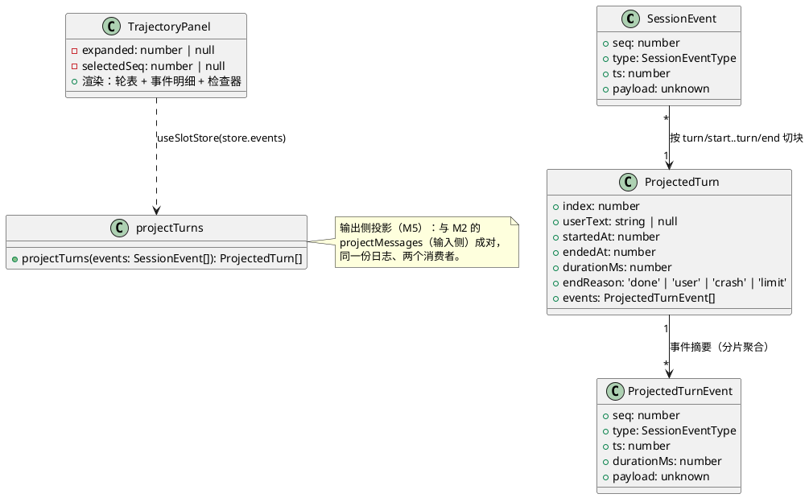
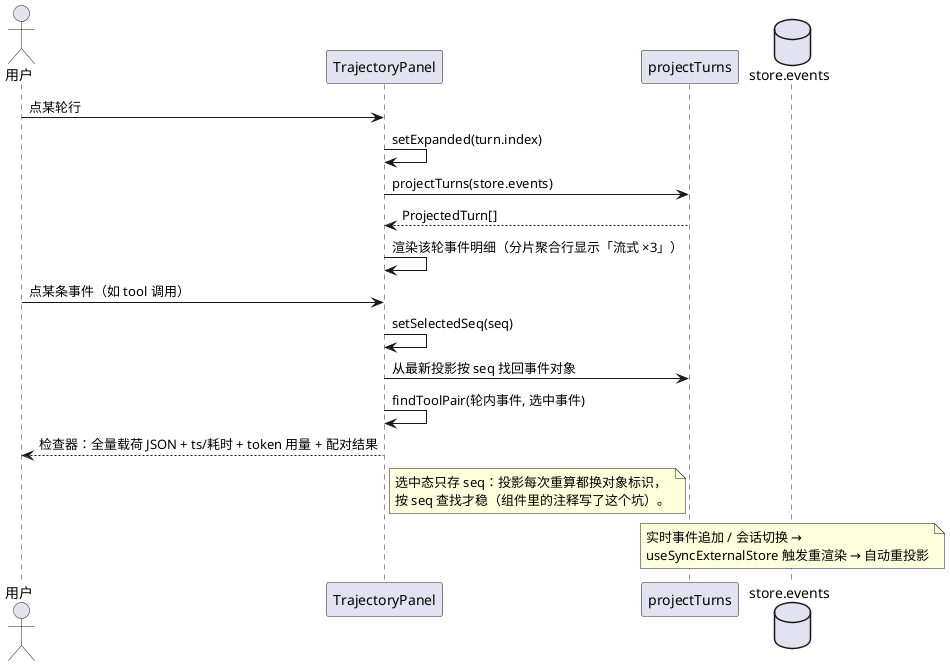

# M5 教程：轨迹与 skills —— 灵魂的最后一环

> 前置：M4（Web 客户端）。零 API key 可跟做。读者：只会基础 TypeScript 的 AI 编程小白。
> 本文每个新概念都从零解释；plantUML 图可直接粘贴到支持它的渲染器查看。

## 1. 动机：从"记下来了"到"看得见、教得会"

### 1.1 问题：日志已经完整，但人是"瞎"的

M1 把会话日志做成了 append-only 真源，M2–M4 让每一轮对话、每一次工具调用、每一个
流式分片都落进了日志。运行 `pnpm demo:session` 你会看到：

```
#2  turn/start
#3  user             {"content":"帮我回显「喂」"}
#4  assistant        {"content":"","toolCalls":[...]}
#5  tool             {"name":"echo","input":{"text":"喂"}}
...
#11 turn/end         {"reason":"done"}
```

数据全在，但**人没法用它**：哪一条属于哪一轮？工具调用花了多久？模型这一轮用了多少
token？出了错是卡在哪一步？这些问题的答案都藏在日志里，可日志只是一串扁平的 JSON 行。

原版 DeepSeek Harness 的 Trajectory 面板就是为此而生的——它是"灵魂"：agent 的每一步
都可以**回放**。M5 的第一个目标就是把这个能力做出来（简化版）。

### 1.2 问题：怎么让 mini 版"教自己"

另一个问题是知识从哪来。M3 给了 agent 工具（动手能力），但"怎么做某件事"的**知识**
（比如本项目的 TDD 纪律）还无处安放。原版的 Skills 系统让模型按需查阅技能文档；
mini 版要能加载**自己仓库里的 TDD skill**（`.agents/skills/tdd/SKILL.md`），让模型
按 TDD 纪律说话——**教学系统教自己**，这就是"自举"（self-hosting）的浪漫闭环。

### 1.3 为什么排在 M5（依赖关系）

| 依赖 | 谁提供的 |
|---|---|
| 日志真源 | M1（事件词汇 + append-only） |
| 工具调用与流式分片落日志 | M3 / M4（轨迹的"素材"） |
| Slot seam 与 extras 区 | M4（轨迹面板 = 再注册一个 slot，shell 一行不改） |
| Tools seam | M3（skill 工具与 bash/fs 并列注册，loop 一行不改） |

M0–M4 把"日志真源 → 投影"的原料与通道全部打通，M5 是 MVP 的**收口**：做完它，
requirements §5 的 10 项 MVP 全部完成。

## 2. 设计：M5 做了什么

M5 两块：**轨迹投影 + 视图**（session → client），**Skills 子系统**（新包
`packages/skill`）。

### 2.1 轨迹的三件套（类图）

"日志真源 → 投影 → 视图"三件套在代码上就是 session（投影）→ client（视图）：



要点：

1. **`projectTurns` 是纯函数**（`packages/session/src/turns.ts`）：输入日志数组，
   输出按轮分组的结构。不读文件、不发请求、不碰 UI——所以 client、未来的 CLI、
   测试都能共用它。
2. **轮 = turn/start 到 turn/end 之间**。轮内每条事件带一个 `durationMs`：
   首条基准是 turn/start 的 ts，其余是"距上一条的 ts 差"。整轮耗时 =
   `endedAt - startedAt`。**耗时一律由 ts 差算出，不另存字段**——不破坏
   append-only（历史日志天然可算）。
3. **分片聚合**：一轮里的 `assistant/stream` 分片合成**一条摘要行**
   `{ chunks: [...], joined: '你好呀' }`，点选可展开看逐片与拼接全文。逐片回放
   动画放 v2（M4 已声明不做）。
4. **usage 落日志**（M4 遗留）：loop 把 `llm.chat` 返回的 `result.usage` 写进
   `assistant` 事件（流式/非流式都写）。旧日志（M2–M4）没有这个字段，检查器
   兜底显示 `—`。
5. **断尾语义**：有未配对的 turn/start（崩溃留下的）时，投影把它当成
   `endReason: 'crash'` 的最后一轮（与 M1 的修复语义一致；投影只读，修复动作
   仍归 `repairDanglingTurn`）。

### 2.2 轨迹面板的交互时序（点选 → 检查器）



### 2.3 Skills 子系统（发现 + 工具调用时序）

```plantuml
@startuml
package "packages/skill" {
  [Skills seam：register/list/get] as SEAM
  [filesystem 发现：<dir>/<name>/SKILL.md] as FS
  [skill 工具：action=list|get] as TOOL
}
database "磁盘：.agents/skills" as DISK
actor "模型（假 LLM 台词）" as LLM
participant "agent loop" as LOOP

DISK --> FS: discoverSkills(dir) 扫描
FS --> SEAM: register({name:'tdd', content:全文})
SEAM --> TOOL: inject 'skills'
TOOL --> LOOP: 注册进 tools seam（与 bash/fs 并列）

LLM -> LOOP: 第 1 步：要工具 skill {action:'list'}
LOOP -> TOOL: execute
TOOL -> SEAM: list()
SEAM --> TOOL: ['tdd']
TOOL --> LLM: { skills: ['tdd'] }（结果回填 messages）
LLM -> LOOP: 第 2 步：要工具 skill {action:'get', name:'tdd'}
LOOP -> TOOL: execute
TOOL -> SEAM: get('tdd')
SEAM --> TOOL: { name:'tdd', content:全文 }
TOOL --> LLM: { name:'tdd', content:全文 }
LLM -> LOOP: 第 3 步：按 TDD 纪律说话
@enduml
```

要点：

1. **Skills seam 是第四个 seam**（继 SessionPersistence、LLM、Tools）：换技能来源
   （远程市场、bundled）只换提供 `skills` 服务的插件。
2. **skill 工具是"文档检索"，不是 prompt 拼接**：不把全部技能塞进 system prompt
   （上下文成本 + 让模型自己决定何时需要），模型按需调用 `list` / `get`。
3. **语义是"输出是内容，异常是结果"**：正常返回内容；模型侧的异常（未知技能、
   坏参数）返回 `{ error }` 结果——模型能看到失败原因并纠正（同 M3 bash 的
   "exit code 是输出不是异常"）。seam 本身对程序调用方是响亮的（抛
   `UnknownSkillError`）。

## 3. 新概念（第一次出现，从零解释）

### 3.1 投影与视图分离

**投影（projection）** = 把日志（真源）换算成某种"可读结构"的纯函数；
**视图（view）** = 把投影结果画出来的 UI。M2 的 `projectMessages` 是输入侧投影
（"模型会看到什么"），M5 的 `projectTurns` 是输出侧投影（"这一轮发生了什么"）。
两者**只读日志、不改日志**；视图（轨迹面板）又是投影的又一个消费者。
好处：换视图（CLI）不用改投影；投影行为全部可以在无浏览器的测试里锁死。

### 3.2 turn 分组

一轮对话（turn）的边界是 `turn/start` 与 `turn/end` 两条事件。投影把它们之间的
事件（user / assistant / 分片 / tool）归成一组，编上 `index`（从 1 开始）。
`turn/end` 的 `reason`（done / limit / crash）透出成 `endReason`——检查器一眼能
区分"正常结束 / 工具步数超限 / 崩了"。

### 3.3 检查器（inspector）

轨迹表里一行事件是"摘要"（seq / 类型 / 耗时 / 一句话），**全量载荷**放在右侧的
检查器里：点选任意事件，看到它的完整 payload JSON、时间戳、token 用量；点 tool
事件还会高亮**调用/结果配对**（同一轮、同名、最近的另一条），配对耗时 = 两条
事件的 ts 差。

### 3.4 Skills seam 与 filesystem 发现

**seam** 你已经认识（M1/M2/M3 都有）：抽象服务 + 可换实现。`SkillsService` 只有
`register / list / get`。**filesystem 发现**是它的第一个实现：约定目录
`<dir>/<name>/SKILL.md`——目录名即技能名，文件正文即内容。边界行为（已测试）：
目录不存在 → 视为"没有技能"（graceful）；路径是文件 → 报错；没有 SKILL.md 的
子目录跳过。

### 3.5 自举（self-hosting）

系统用自己提供的能力服务自己。这里：mini 版加载并运行**它自己项目的 TDD skill**
（`.agents/skills/tdd/SKILL.md`），模型因此学会"先写失败的测试"。验收测试
`packages/skill/tests/bootstrap.e2e.test.ts` 断言模型收到的内容 == 磁盘文件正文。

### 3.6 usage 落日志

模型每次调用返回 token 用量（输入/输出）。M5 起 loop 把它写进 `assistant` 事件的
`usage` 字段——检查器的 token 显示直接读日志，不另存一份用量。字段是**可选**的：
M2–M4 的旧日志没有它，投影与 UI 兜底显示 `—`（向后兼容）。

## 4. 取舍（tradeoff）与理由

### 4.1 为什么轨迹是"投影"而不是"另存一份"

另存一份（比如每轮结束时写一个 `turn_summary` 表）会遇到真源问题：两份数据谁
说了算？改投影规则后旧 summary 全错；崩溃时 summary 可能没写完。**投影是纯函数，
随时可重算**：规则升级（如加 token 显示）对所有历史日志立即生效，崩溃也没有
"写到一半的投影"。代价是每次渲染都重算一遍——日志体量小，可接受（虚拟滚动是
v2 的事）。

### 4.2 为什么 skill 是文档检索，不是 prompt 拼接

把全部技能拼进 system prompt：每轮都全量发送（上下文成本）、技能变多时 prompt
失控、模型没法"按需"。检索式（工具化）：技能列表只占一次工具声明，模型自己
决定何时 `get`；拿到的正文是**按需注入的上下文**。代价是多了两次模型往返
（list → get）——这正是 agent loop（M3）要能循环调用工具的原因。

### 4.3 为什么分片聚合展示（逐片回放放 v2）

一轮流式回复的几百个分片若逐条占一行，轨迹表立刻被淹没；聚合一行
（「流式 ×3」+ 可展开）保住了"分片确实发生了"的可见性，又不牺牲可读性。
逐片 token 级回放动画是 v2（backlog #3：虚拟滚动 + 时间线概览一起做）。

### 4.4 为什么虚拟滚动放 v2

MVP 会话只有几十条事件，直接渲染完全够用；虚拟滚动是长会话（上千轮）的性能
优化，属于"锦上添花"而非"灵魂"。先让投影与视图正确，再谈性能。

### 4.5 为什么 usage 是可选的字段而不是新事件

token 用量属于"这次 assistant 回复"的属性，放在载荷里最自然；新事件类型会让
旧投影逻辑复杂化（配对、顺序），而可选字段对旧日志天然兼容（无字段 → `—`）。

## 5. 小白看这份代码，按什么顺序读

**第 0 步（先跑再说）**：`pnpm demo:trajectory --clean`，看两幕输出（轨迹回放 +
skill 自举）；再 `pnpm demo:web:fake` 在浏览器发一轮消息，点底部「轨迹」面板的轮行
与事件行。带着"这些数据从哪来"的问题读码。

**第 1 步，投影**：`packages/session/src/turns.ts`（约 150 行）。先读类型
（`ProjectedTurn` / `ProjectedTurnEvent`），再读 `projectTurns` 的切块循环：
turn/start 开轮、turn/end 闭轮、分片聚合分支、末尾断尾的 crash 语义。对照
`packages/session/tests/turns.test.ts` 的每个断言读，事半功倍。

**第 2 步，usage 词汇增量**：`packages/session/src/events.ts` 的
`AssistantEventPayload.usage` + `packages/agent/src/loop.ts` 里
`usage: result.usage` 那一行——"检查器的数据从日志来"的源头。

**第 3 步，Skills seam 与发现**：`packages/skill/src/skills.ts`（契约最小）
→ `fs-discovery.ts`（目录约定 + 边界）→ `tool.ts`（"输出是内容，异常是结果"）。
对照契约套件 `tests/contracts/skills-contract.ts` 与 `tests/fs-discovery.test.ts`。

**第 4 步，轨迹面板**：`packages/client/src/ui/trajectory.tsx`。注意三件事：
slot 注册（`uiTrajectory` 插件，与 M4 的 uiTool 同构）、`useSlotStore` 消费
store、`selectedSeq` 按 seq 找回事件对象（为什么不用对象引用——注释里写了坑）。

**第 5 步，端到端**：`packages/skill/tests/bootstrap.e2e.test.ts`（自举：模型收到
SKILL.md 全文）与 `packages/client/tests/trajectory.test.tsx`（真 host + jsdom：
轮表/检查器/兜底）。

## 6. 动手练习（零 API key）

### 练习 1：demo 里回放一轮对话并点选检查器

```bash
pnpm demo:trajectory --clean   # 终端：两幕全流程
pnpm demo:web:fake             # 浏览器：http://127.0.0.1:8080（零 key 假 LLM 台词本）
```

浏览器里新建会话 → 发一条消息 → 等轮次结束 → 看底部**轨迹面板**：
① 点轮行展开事件明细（找「流式 ×N」聚合行）；② 点 tool 事件 → 检查器显示
input 与配对结果 output；③ 点 assistant 终事件 → 看 token 用量。
**验收标准**：能说出"轨迹表里的 6 个事件"分别对应日志里的哪 6 条。

### 练习 2：注册一个自己的 skill 并让假 LLM 调用它

```bash
pnpm tsx packages/skill/examples/my-skill.ts
```

打开 `packages/skill/examples/my-skill.ts`：把 `MY_SKILL_BODY` 改成你自己的技能
（比如"回答必须押韵"），再跑一次。
**验收标准**：打印的"模型收到的全文"随你的改动而变化，且与磁盘文件一致。

### 练习 3：给轨迹面板改一个 slot 玩法

```bash
pnpm vitest run --project dom packages/client/tests/my-trajectory.test.tsx
```

`packages/client/tests/my-trajectory.test.tsx` 注册了一个"迷你轨迹"面板
（只显示第一轮耗时）。**红绿翻转**：把插件里注册的 slot 名从 `'my-mini-trace'`
改成 `'trace-v2'` → 测试变红（断言找的是 `[data-slot="my-mini-trace"]`）→ 改回来
回绿。**验收标准**：能解释为什么改 slot 名会让断言失败（extras 区按 slot 名装配）。

### 练习 4（进阶）：断言 projectTurns 的红绿翻转

```bash
pnpm vitest run --project node packages/session/tests/my-turns.test.ts
```

删掉 `packages/session/tests/my-turns.test.ts` 里 events 中的第二条分片
（`content: '好'`）→ 红（分片聚合行只剩 2 片）→ 加回去回绿。
**验收标准**：能解释"分片聚合行 = { chunks, joined }"与删除一条分片的关系。

## 7. 常见问题

**Q：轨迹面板为什么不放在主三栏里？**
A：它走 M4 的 Slot 机制（extras 区全宽面板）。主三栏是 shell 的固定布局，轨迹
是"另一个消费者"——这正是 M4 spec 承诺的"未来任意 ui-* 插件从 Slot 挂进来"的
第一次兑现。

**Q：skill 工具返回 { error } 而不是抛错，算不算"吞错"？**
A：不算。seam 的 `get` 仍然抛 `UnknownSkillError`（程序调用方是响亮的）；工具
把模型侧的"失败"转成**结果**（同 bash 的 exit code），因为模型需要失败原因来
纠正，而不是把整轮炸掉。意外的内部错误仍原样上抛。

**Q：旧会话（M2–M4）的日志能进轨迹面板吗？**
A：能。usage 缺省显示 `—`，其余字段（ts 差、轮切块）对旧日志同样成立——投影
是纯函数，规则对全部历史立即生效。

## 8. 小结

M5 补上了三件套的最后一环：**投影（projectTurns）把日志变成可回放的轨迹，
视图（slot trajectory）让人点选检查每一步，skills 让系统能加载并运行自己的
TDD skill**。至此 MVP 10 项全部完成——日志是真源，Trajectory 是灵魂，而 agent
能"教自己"了。backlog 里的 Trajectory v2（虚拟滚动/时间线概览/逐片回放）、
CLI、审批栈，都可以从这些 seam 挂进来。

## 附录：教程练习文件

| 练习 | 文件 |
|---|---|
| 2 自己的 skill | `packages/skill/examples/my-skill.ts` |
| 3 slot 玩法 | `packages/client/tests/my-trajectory.test.tsx` |
| 4 projectTurns 翻转 | `packages/session/tests/my-turns.test.ts` |
