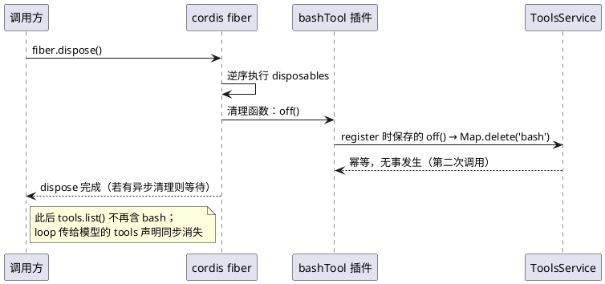

# M6 教程：注册与撤销——插件能装上，也要能拆下

> 读者：AI 编程小白（会基础 TypeScript 即可）· 零 API key 可跟做 · 配套里程碑 spec：
> `docs/milestones/M6.md`

## 1. 动机：M0 说"一切皆为插件"，但只有半条命

从 M0 起我们就反复说：mini-deepseek-harness 的一切都是插件——工具是插件、UI 面板是插件、
连会话本身都是插件。但 M6 之前有个隐患：**插件装得上去，拆不下来**。

卸载一个"把 bash 工具注册进注册表"的插件后，bash 工具**仍然留在注册表里**，
agent loop 还是会把它声明给模型。上游 deepseek-harness 的架构文档里有一句原话：

> **"registrations are effects that unwind when their plugin unloads."**
> （注册就是 effect：插件卸载时，它的注册自动撤销。）

M6 的目标：把这句话在 mini 版里兑现——**每一个注册点都能撤销，卸载即消失**。

## 2. design：一个模式吃遍全部注册点

M6 只引入一个模式，没有发明任何新框架：

```text
┌──────────────┐  register(x)   ┌──────────────────┐
│   插件 plugin │ ─────────────▶ │ 注册表（Map/Set） │
│              │  返回 off()    │                  │
│              │ ◀───────────── │                  │
└──────┬───────┘                └──────────────────┘
       │ ctx.effect(() => () => off())
       ▼
┌──────────────────────────────┐
│ 插件自己的 fiber（生命周期）   │   fiber.dispose() 时，
│ disposables: [..., off]      │   cordis 逆序执行清理
└──────────────────────────────┘
```

- **注册 API 返回撤销函数**：`register(x)` 不再返回 `void`，而是返回一个幂等的
  `off()`（重复调用无害；只撤销"我注册的那一个"，不误删后来同名重注册的）。
- **注册方挂 `ctx.effect`**：`ctx.effect(() => () => off())` 把撤销函数塞进插件
  自己的 fiber 生命周期。fiber 卸载时 cordis 会**逆序执行**所有清理函数——
  如果清理返回 Promise（如 session 的 flush），cordis 还会**等它完成**。

时序（卸载一个工具插件时）：



M6 的落地范围（`docs/milestones/M6.md` 任务拆解）：

| 注册点 | 文件 | 撤销形态 |
|---|---|---|
| Tools 注册表 | `packages/tools/src/tools.ts` | `register`/`addHook` 返回 `Unregister` |
| Skills 注册表 | `packages/skill/src/skills.ts` | `register` 返回 `Unregister` |
| RPC 方法 | `packages/web/src/bridge.ts` | `handle` 返回 `Unregister` |
| UI slot | `packages/client/src/slots.ts` | `register` 返回 `Unregister` |
| client 订阅链 | `packages/client/src/{store,connection,shell}.ts` | `store.dispose()` + `bridge.close()` 幂等清理 |
| 会话落盘 | `packages/session/src/session.ts` | `ctx.effect(() => () => flush())`（cordis 会 await） |
| loop 句柄 | `packages/agent/src/loop.ts` | `ctx.effect(() => () => Reflect.deleteProperty(...))` |

## 3. 新概念

- **可逆注册 / 撤销函数**：注册动作返回一个"撤销这次注册"的函数（closure）。
  对比"按名删除"（`unregister(name)`）：闭包直接持有被注册对象，天然避免
  "删错同名项"；调用方无需再传一次名字。
- **effect 清理**：`ctx.effect(() => cleanup)` 是 cordis 的"注册即 effect"原语——
  cleanup 函数被记入插件 fiber 的 disposables，卸载时逆序执行；返回 Promise 会被等待。
- **HMR-safety 测试**：上游 testing.md 的纪律——"每个注册表都要有一个
  dispose 注册方 fiber → 断言注册消失的测试"（HMR = 热替换，动态装卸插件的前置）。
- **订阅泄漏（listener leak）**：订阅了别人的回调却不保存退订函数。M6 之前
  client 的 store 订阅了桥、桥订阅了 transport，退订函数全部被丢弃——shell
  卸载后 store 被桥强引用，永远无法回收。
- **幂等卸载**：撤销/关闭/清理重复调用无害（第二次调用是 no-op）。

## 4. tradeoff：为什么这样选

1. **返回撤销函数，而不是 `unregister(name)`**：二义性最少（不删错同名项）、
   无需调用方记得名字、与 cordis 的 `ctx.effect` 天然咬合（注册写进 setup、
   撤销写进 cleanup，一一对应）。
2. **webHost 默认自建桥，为什么还要挂 effect**：默认路径里桥随插件一起消亡
   （无人再引用），确实不挂也能工作；但**注入桥**的路径（测试、未来的 HMR）
   必须正确撤销——统一挂 effect 让两条路径行为一致，HMR-safety 测试守护的
   正是注入路径。
3. **订阅链的清理归 clientShell（装配者）而不是 store（服务）**：store 不知道
   自己是不是最后一个消费者；shell 是装配点（M4 决策），由它决定何时"整条链
   都该关了"——store 提供 `dispose()`（退订+清监听器），shell 在 effect 里
   调它并 `bridge.close()`。
4. **会话卸载 = 等落盘，而不是"尽力而为"**：cordis 会 await 返回 Promise 的
   effect 清理，所以 flush 排空是**确定性**的（测试里用 50ms 慢后端实证：
   不等待的卸载会赶在写入完成前返回）。

## 5. stepbystep：怎么看 M6 的代码

按这个顺序读（每步都标了"看什么"）：

1. **spec 与测试入口**：`docs/milestones/M6.md`（七任务拆解）→
   `packages/tools/tests/reversibility.test.ts`（HMR-safety 测试长什么样）。
2. **模式本体**：`packages/tools/src/tools.ts` 的 `register` 实现——看撤销函数
   如何"只删自己的注册"（`tools.get(name) === tool` 守卫）。
3. **注册方怎么挂**：`packages/tools/src/bash.ts`（`ctx.effect(() => () => off())`）。
4. **撤销函数集中一处**：`packages/client/src/shell.ts` 的 `registerSlot` 助手
   （四个 ui 插件都走它，DRY + 教学点集中）。
5. **订阅链闭环**：`store.ts` 的 `offEvent` 持有 → `connection.ts` 的
   `offMessage/offClose` 持有 → `shell.ts` 的 effect 收尾。
6. **异步清理被等待**：`packages/session/src/session.ts` 的
   `ctx.effect(() => () => this.flush())`——这是"cordis 会 await 清理 Promise"
   的实证点。

## 6. 动手练习（零 API key，全部复制即跑）

每个练习都先做"红绿翻转"：故意写错的期望 → 看测试红 → 改对 → 绿。
红的理由都写在测试文件头部注释里。

### 练习 1：卸载工具插件（`packages/tools/tests/my-unload-tool.test.ts`）

```sh
pnpm vitest run packages/tools/tests/my-unload-tool.test.ts
```

1. 打开文件，把第 23 行的期望改成"卸载后工具还在"：`toContain('bash')` → 跑 → **红**；
2. 改回 `toEqual([])` → 跑 → **绿**。

思考题：M6 之前"工具还在"反而是绿的——红绿翻转告诉你 bug 已经修了。

### 练习 2：撤销 RPC 方法（`packages/web/tests/my-rpc-off.test.ts`）

```sh
pnpm vitest run packages/web/tests/my-rpc-off.test.ts
```

1. 把第 37 行改成 `{ ok: true }`（期望撤销后仍能调用）→ 跑 → **红**；
2. 改回 `{ ok: false, error: { name: 'UnknownMethodError' } }` → 跑 → **绿**。

### 练习 3：卸载 UI 面板（`packages/client/tests/my-slot-off.test.ts`）

```sh
pnpm vitest run packages/client/tests/my-slot-off.test.ts
```

1. 把第 33 行改成 `toEqual(['tool'])`（期望 slot 还在）→ 跑 → **红**；
2. 改回 `toEqual([])` → 跑 → **绿**。

### 练习 4（进阶）：计时器也是注册（`packages/kernel/tests/my-interval.test.ts`）

```sh
pnpm vitest run packages/kernel/tests/my-interval.test.ts
```

1. 删掉第 23 行 `ctx.effect(() => () => clearInterval(timer))` → 跑 → **红**
   （卸载后计时器还在跳，ticks 继续增长）；
2. 加回来 → 跑 → **绿**。

领悟点：`setInterval` 也是一种"注册"——凡是有资源需要"装上后拆下"的地方，
都是 effect。M6 的模式不只属于注册表。

## 7. 验收（requirements §5.1 小白验收 + §10）

- [x] 四个练习零 key 复制即跑，红绿翻转实测成立（本教程交付时逐一手动验证）
- [x] 全量测试绿（node + jsdom 双 workspace）；typecheck 全绿
- [x] HMR-safety 测试组：tools / skill / web / client / session / agent 各一组
- [x] 卸载任一注册插件后其注册项消失（工具 / RPC 方法 / slot / 订阅 / 句柄）
