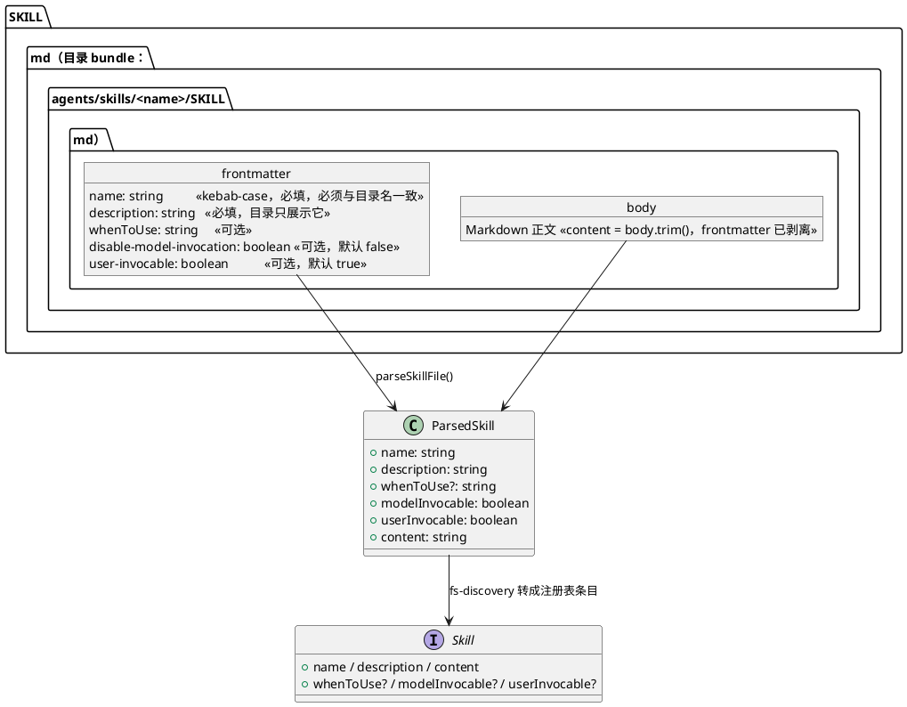
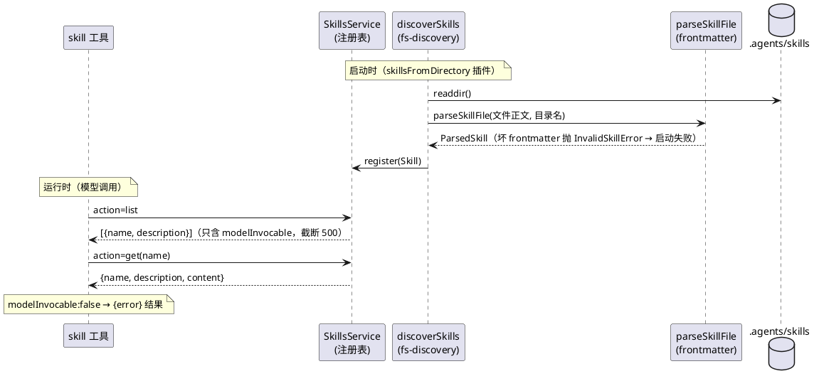

# M7 教程：原版 AI 技能移植 —— SKILL.md 格式契约与 mini 化改写

> 前置：M5（Skills 子系统）。零 API key 可跟做。读者：只会基础 TypeScript 的 AI 编程小白。
> 本文每个新概念都从零解释；plantUML 图可直接粘贴到支持它的渲染器查看。

## 1. 动机：M5 有"装技能的口袋"，但没有"能被模型看懂的口袋标签"

### 1.1 问题一：frontmatter 被无视，模型"看不见"技能是干什么的

M5 做的 Skills 子系统只定义了最朴素的约定：目录名即技能名、`SKILL.md` 全文即内容。
但我们的 `tdd` 技能文件其实是长这样的：

```markdown
---
name: tdd
description: 测试驱动开发纪律：red→green→refactor。……
---

# TDD（测试驱动开发）
……
```

`---` 之间的那几行叫 **frontmatter**（文件头部的元数据）。M5 的解析器不认识它：既没有
读 `description`，还把 `---` 到正文全部当"内容"塞给了模型。后果是什么？看 M5 的
`skill` 工具 `action=list` 返回什么：

```json
{ "skills": ["tdd"] }
```

只有**名字**。模型只知道"有个技能叫 tdd"，不知道它是干什么的——名字不携带语义，
模型就没法决定"现在该不该加载它"。原版 DeepSeek Harness 的做法是：目录里每个技能
展示 **name + description**，description 就是给模型的**路由标签**（"如果任务像这句
话描述的那样，就加载这个技能"）。

### 1.2 问题二：M5 只有"机制"，没有"内容"

M5 交付了技能系统（注册表 + 发现 + 工具），但仓库里只有一个 `tdd` 技能。原版
deepseek-harness 的 `.agents/skills/` 下有一整套技能（代码审查、行文标准、思维链
泄漏修剪、push 前检查……），是"AI 技能"这个概念的教材级范本。M7 要做两件事：

1. **学格式**：落地原版的 SKILL.md 格式契约（frontmatter 字段、fail-closed 校验）；
2. **搬内容**：把合适的一批上游技能 copy/改写成 mini 版，让它们在本仓库**真实可用**。

### 1.3 为什么排在 M7（依赖关系）

| 依赖 | 谁提供的 |
|---|---|
| Skills seam（注册表 + filesystem 发现 + `skill` 工具） | M5（本 M 只升级解析器与工具结果，不新建包） |
| 注册可逆（`register` 返回撤销函数、HMR-safety 测试） | M6（本 M 的校验逻辑不破坏撤销语义，契约测试回归确认） |
| 上游索引与"照搬概念不照搬代码"纪律 | `docs/references/upstream.md` §M7 |

## 2. 设计：M7 做了什么

M7 在 `packages/skill` 内加了**一个解析模块**（frontmatter 契约），升级了**发现与
工具**（目录展示），并在 `.agents/skills/` 下新增 **6 个移植技能**。

### 2.1 SKILL.md 格式契约（类图）



### 2.2 发现与加载管线（时序图）



### 2.3 落地物

| 文件 | 变化 |
|---|---|
| `packages/skill/src/frontmatter.ts` | **新**：`parseFrontmatter` / `parseSkillFile` / 宽松布尔 / legacy 键拒绝 |
| `packages/skill/src/skills.ts` | `Skill` 增 `description` 等字段；register 校验 + 调用策略默认规范化 |
| `packages/skill/src/fs-discovery.ts` | 用 `parseSkillFile` 解析校验，坏条目抛错并带文件路径 |
| `packages/skill/src/tool.ts` | list 返回 `{name, description}`（过滤 + 截断）；get 校验链 + 返回 description |
| `.agents/skills/*/` | 新增 6 个移植技能（见 §3.4） |

## 3. 新概念（每个都从零解释）

### 3.1 frontmatter

Markdown 文件开头的元数据块：以一行 `---` 开始、一行 `---` 结束，中间是 YAML 格式的
键值对。它描述"这个文件是什么"，而不参与正文。你的 `tdd/SKILL.md` 开头那 4 行就是
frontmatter。M7 起它是**必须的**：没有 frontmatter 的 SKILL.md 会被拒绝。

### 3.2 fail-closed（失败时默认拒绝）

安全设计原则：**解析不出、校验不过的东西，默认"不给"，而不是默认"给"**。举个反例：
如果 `disable-model-invocation` 写成了拼错的 `disableModelInvocation`，而解析器"宽容"
地当作没写，结果就是这个本想让模型**不可调用**的技能反而**可调用**了——宽容把禁用
接口暴露了。M7 的响应是：驼峰 legacy 键、非布尔调用值、坏 YAML、name 与目录名不符，
**一律抛错**（条目被排除，整个发现中止），绝不静默放行。

### 3.3 调用策略四象限

两个独立的布尔开关规范化为正向值：

| `modelInvocable` | `userInvocable` | 谁能加载 |
|---|---|---|
| true | true | 模型（skill 工具）+ 用户（未来的 slash 菜单） |
| true | false | 仅模型 |
| false | true | 仅用户显式触发（`disable-model-invocation: true` 的唯一归宿） |
| false | false | 只有受信的 `SkillsService.get()` 调用方 |

frontmatter 写的是负向键 `disable-model-invocation` 和正向键 `user-invocable`，解析后
统一变成两个正向布尔。**过滤发生在消费方**（skill 工具），`SkillsService.get` 保持
受信不过滤——这是上游的"消费方边界纪律"。

### 3.4 目录（catalog）与正文（content）的分离

目录 = 技能清单（name + description），用来**路由**；正文 = SKILL.md 的 Markdown 正文，
用来**执行**。模型先 list 看目录（便宜），按 description 决定加载哪个，再 get 全文
（贵）。M7 的 list 只返回 name + description，且 description 规范化（连续空白折成一个
空格）并**截断 500 字符**（超长补 `...`）——目录的 token 成本被钉死，而正文不限长。

## 4. tradeoff：关键取舍与理由

### 4.1 单根 `.agents/skills`，不学上游的 rank 多根扫描

上游按 rank 扫描 6 类根（`.dsh/skills` 100 / `.agents/skills` 200 / 自定义 300 / 用户
两级 / bundled 600），还要处理重名裁决。mini 只有一个根 `.agents/skills`——教学仓库
没有"项目 vs 用户 vs 随包"的冲突场景，多根带来的复杂度全是负资产。Seam 不变
（`SkillsService`），未来要远程市场时再加 provider 即可。

### 4.2 坏条目"抛错"而不是上游的"警告 + 跳过"

上游是多 provider 生产环境：一个坏技能不该杀死整个 agent，所以跳过并记录警告。mini
是单根、开发者自管的仓库：坏 SKILL.md 与坏 profile 一样是配置错误，M5 已有先例
（"路径是文件 → 报错"）。抛错让"我的技能怎么不见了"变成一条带文件路径的明确错误，
而不是沉默消失 + 一行容易被忽略的日志。

### 4.3 工具结果是 JSON，不学上游的 `<skill_content>` 包装

上游把技能正文包成 `<skill_content name="...">…</skill_content>` 再给模型（两条加载
路径共享一个渲染真源）。mini 的 wire 格式从 M5 起就是 JSON（`{name, content}`），
M7 只加 `description` 字段——JSON 的结构边界已经告诉模型"这是技能名、这是正文"，
XML 包装在 mini 里是多余的一层。概念（共享渲染真源）记下，留给未来有第二条加载路径
时再用。

### 4.4 description 截断 500 放在消费方（skill 工具）

上游同样如此（`catalogDescriptionMaxLength` 是消费方配置）：注册表存完整 description，
工具渲染目录时才规范化 + 截断。理由：截断是**展示决策**，不是数据事实——换个消费方
（比如未来的 slash 菜单）可能有不同的截断需求；数据层保持完整，展示层各自定规矩。

### 4.5 用 `yaml` 包而不是手写解析器

frontmatter 是 YAML，而 YAML 的布尔宽松语义（`yes/no/on/off/1/0`）手写子集解析器很
容易错。上游也用 `yaml` 包（本项目首个第三方解析依赖）。"照搬概念不照搬代码"不
禁止用同一个依赖——省下的手写风险可以全部投给 seam 本身的教学价值。

### 4.6 目录按需拉取，不学上游的自动注入

上游在每轮对话前把 `<available_skills>` 目录自动注入会话（pre-step），`skill` 工具
只有 `name` 一个参数。mini 的 loop 没有 pre-step 注入点（M5 决策），所以 `skill` 工具
保留了 `list`/`get` 两个动作，模型**按需**拉目录。代价是模型可能不知道有技能可用
（需要 prompt 提示或它自己想起来调用），好处是上下文零成本、且不引入 pre-step
机制。M5 已定，M7 不改。

## 5. stepbystep：从头到尾看代码

按"数据流向"的顺序读，每步都可以 `git log --oneline` 找到对应提交（RED/GREEN 分开）。

1. **契约长什么样**：`packages/skill/src/skills.ts` —— `Skill` 接口（name/description/
   content + 可选 whenToUse/调用布尔）、`isSkillName`（kebab 正则）、`validateSkill`
   与 `normalizeSkill`（register 时校验 + 默认补 `true`）。
2. **解析器**：`packages/skill/src/frontmatter.ts` —— 先 `parseFrontmatter`（首行
   `---`、找闭合行、`yaml` 包解析、必须普通对象），再 `parseSkillFile`（按序校验：
   缺 frontmatter → 缺 name/description → 非 kebab → 与目录名不符 → legacy 键 →
   宽松布尔 → 产出 `ParsedSkill`，content = body.trim()）。
3. **发现器**：`packages/skill/src/fs-discovery.ts` —— `discoverSkills` 把每个
   `<name>/SKILL.md` 交给 `parseSkillFile(raw, 目录名)`，`InvalidSkillError` 包装上
   文件路径再抛；正常结果转成 `Skill` 注册。
4. **消费方**：`packages/skill/src/tool.ts` —— `catalogDescription`（空白折叠 + 500
   截断）、list（过滤 modelInvocable）、get（kebab → 查表 → modelInvocable → 结果）。
5. **内容**：`.agents/skills/{code-review,prose-standard,trim-cot-leakage,
   pre-push-checks,doc-standards,archive-agent-notes}/SKILL.md` —— 上游技能的 mini 化
   改写（去 `dsh-` 前缀、去上游专有引用、换 mini 对应物、全中文）；带 `references/`
   附件的技能连附件一起搬。
6. **验收**：`packages/skill/tests/bootstrap.e2e.test.ts` —— 真 host + 真发现 + 假 LLM
   台词，断言目录 7 技能、正文与磁盘剥离后一致、按 description 路由成功。
7. **演示**：`packages/agent/examples/skills-demo.ts`（`pnpm demo:skills`）三幕：
   目录 → 按描述路由 → 调用策略。

## 6. 动手练习（零 API key）

### 练习 1：玩坏 frontmatter（红绿翻转）

```sh
pnpm vitest run --project node packages/skill/tests/my-frontmatter.test.ts
```

先跑一次 → 全绿。然后打开 `packages/skill/tests/my-frontmatter.test.ts`：

1. 把 fixture 里的 `description: 回答前先说一个冷笑话` 整行**删掉** → 再跑 →
   **红**：报 `requires description`——技能被 fail-closed 排除，发现中止；
2. 把 `name: my-tip` 改成 `name: joker`（与目录名不符）→ **红**：报
   `does not match directory`；
3. 改回原样 → 绿。

你刚刚亲手验证了 §3.2 的 fail-closed：坏条目响亮失败，绝不默认放行。

### 练习 2：让模型"看不见"一个技能（调用策略）

```sh
pnpm tsx packages/skill/examples/my-skill.ts
```

先跑一次 → 模型拿到了 poet 技能的正文。然后给它的 frontmatter 加一行：

```yaml
disable-model-invocation: true
```

再跑 → 你会发现 `action=get poet` 返回了
`skill "poet" is not available for model invocation`。这个技能的正文模型再也拿不到了，
但 `SkillsService.get` 仍然拿得到（受信调用方不受限）——这就是四象限里的
"仅用户显式触发"。

### 练习 3：看真技能系统怎么发现你写的技能（彩蛋）

本会话正在运行的 DeepSeek Harness（真实原版）也在扫描这个仓库的 `.agents/skills`：
你在练习 1/2 里写的临时技能若放进 `.agents/skills/`，下一次会话开场时它的
description 就会出现在真实 harness 的技能目录里——本仓库的技能体系与上游格式
完全同构，这是 M7 移植成功的最好证据。

## 7. 验收对照（requirements §9 M7 行）

- [x] `skill` 工具可列出并加载全部移植技能（7 个，description 正确显示）；
- [x] 移植技能在本仓库真实可用（`pnpm demo:skills` 三幕零 key 实测；
      `code-review` 的检查项对应 mini 的真实命令与文档）；
- [x] 零 key 验收：demo 与全部练习由假 LLM / 测试脚手架驱动。

下一篇：M8（subagent/workflow）——多智能体编排。
