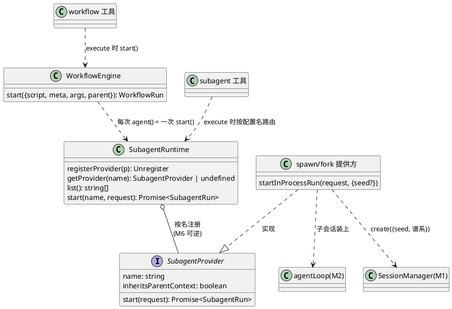
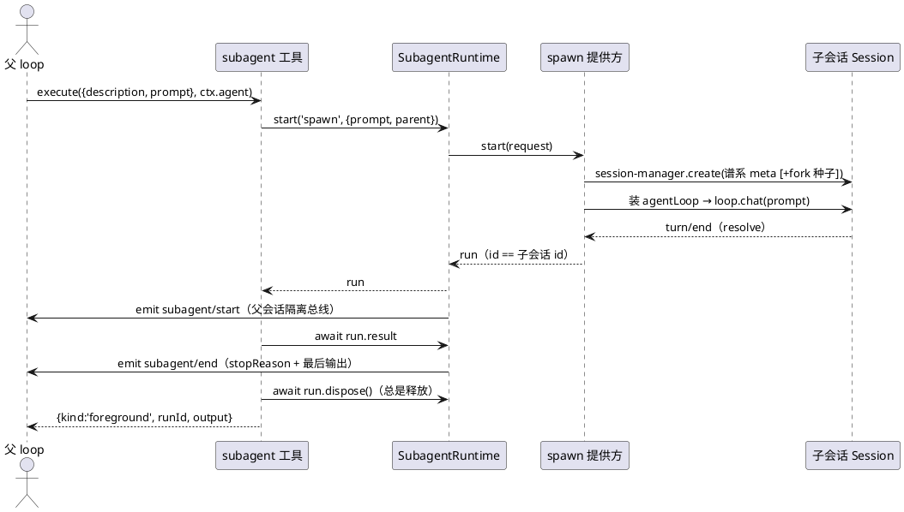

# M8 教程：subagent / workflow —— 让一个 agent 变成"能招人的 agent"

> 面向 **AI 编程小白**：只需要基础 TypeScript 和命令行。本篇所有命令零 API key 可跑，
> 练习由假 LLM / 测试脚手架驱动。学完你能回答：子代理怎么派生？结果怎么回收？
> workflow 脚本钩子怎么编排？以及——为什么这一整章**一行都没改 agent loop**。

## 1. 动机：这个 M 解决什么问题、为什么排在这里

先回忆一下 mini 已经有什么（M0–M7）：

- **M0–M2**：cordis 内核、会话日志、LLM seam、agent loop——"一个人 + 一个日志"。
- **M3**：Tools seam——这个人会**用工具**了（bash/文件）。
- **M5**：Trajectory——这个人的每一步都被**回放**。
- **M6**：一切注册可逆——每个插件装上能卸、卸了不留痕。
- **M7**：skills——这个人会**查说明书**了。

但直到 M7，agent 仍然是**单打独斗**：一次对话、一套工具、一条日志。遇到"把整个仓库
审计一遍"这种任务，它只能自己一轮一轮地干，上下文越滚越长。

原版 DeepSeek Harness 的答案是 **subagent**：agent 把工作**委派**给子 agent。子 agent
有自己独立的会话（自己的上下文、自己的轨迹），父 agent 只拿回最终结果——上下文隔离、
轨迹可回放、工作可并行。再往上一层是 **workflow**：模型直接写一段 JS 脚本，用
`parallel`/`pipeline` 编排**一大批** subagent——"agent 干活，脚本协调"。

所以 M8 排在这个位置，是因为它把前面所有 M 变成了**可复用的积木**：

```
M8 的新东西只有"编排"这一层。
┌─────────────────────────────────────────────┐
│ workflow 脚本（模型写的 JS：谁并发、谁串行）     │ ← M8 新增
├─────────────────────────────────────────────┤
│ subagent 委派（spawn/fork：一次派一个子 agent）│ ← M8 新增
├─────────────────────────────────────────────┤
│ agent loop（M2/M3：拿输入→调模型→写输出）       │ ← 一行不改
│ Tools seam（M3）· Skills（M5/M7）· 注册可逆（M6）│ ← 直接复用
└─────────────────────────────────────────────┘
```

如果 M8 做成了，M9 的 MCP（外部工具注册进 Tools）、M10 的 plan/todo 都可以用同样的
"能力 seam + 工具 + 事件"模式挂进来。

## 2. design：M8 做了什么

M8 交付两包两工具 + 一次会话谱系扩展：

| 落地物 | 一句话 |
|---|---|
| `@mini-dsh/subagent` 的 `ctx.subagents` | **具名 provider 注册表**（多实现 seam）：`registerProvider / getProvider / list / start(name, request)` |
| `spawn` / `fork` 提供方 | 进程内子 agent 传输：子会话 = 独立 Session + agentLoop |
| `subagent` 工具 | 模型按需委派：前台等结果 + 总是释放 |
| `@mini-dsh/workflow` 的 `ctx.workflowEngine` | 同线程执行模型写的编排脚本（meta/脚本 parse 先行） |
| `workflow` 工具 | 模型的脚本入口：`{script, meta, args}` → 脚本最终 JSON 值 |
| session 包扩展 | `SessionMeta` +`parentSessionId`/`depth`（谱系）；`create({seed})`（fork 种子） |

### 2.1 组件关系（类图）



### 2.2 一次委派的生命周期（时序图）



### 2.3 三条最关键的语义

1. **`SubagentRun.result` 失败不 reject**。子 agent 干砸了（模型 crash、工具步数超限），
   result **正常 resolve**，只是 `stopReason` 不是 `completed`。只有"起不来"这种
   基础设施故障才会 reject。消费方（工具）把非 completed 映射成 isError，并保留子
   agent 的部分输出——截断的回答不冒充成功。
2. **父会话污染最小**。一次委派绝不写父会话：父日志只多一对 `tool` 事件（调用/结果，
   结果里带子会话 id）。`subagent/*`、`workflow/*` 观察事件 emit 在父会话 ctx 的
   **隔离事件总线**上——你看得见，但日志里没有它。子会话是独立 JSONL，随时可回放。
3. **fatal 纪律**。workflow 脚本误用钩子（拼错选项、坏参数）抛 `fatal: true` 的
   `WorkflowError`；`parallel()`/`pipeline()` 对 fatal **直接 re-throw**，逐项 `null`
   只留给"子 run 失败"和"阶段内普通脚本错误"——拼错一个选项必须杀脚本，绝不静默
   消融成某个 null。

## 3. 新概念（首次出现，从零解释）

- **provider 注册表（多实现 seam）**：bash 是"每个 ctx 只有一个执行器"的**单实现
  seam**；`ctx.subagents` 是**多实现注册表**——多个提供方按名共存（`spawn`、`fork`），
  调用方按名路由。这是上游 LLM 适配器注册表的同款模式。什么时候用哪种？"能力有多
  种传输/实现、按部署选择"就用注册表；"全系统只有一个正确实现"就用单服务。
- **委派与谱系（parentSessionId / depth）**：子会话的 meta 记"谁派生的我"（父会话 id）
  和"第几层委派"（深度 = 父深度 + 1）。mini **只记账不设限**——上游的深度上限属于
  "能力矩阵"，砍掉了。谱系让轨迹面板/会话列表能回答"这些会话谁是谁的子"。
- **spawn vs fork（inheritsParentContext）**：spawn 的子 agent **空对话**开始
  （`false`）；fork 的子 agent 以父日志的"**平衡已完成轮次前缀**"为种子（`true`）。
  "平衡" = 截至最后一个 `turn/end`——父当前进行中的轮次是不平衡的（有 tool 调用没
  结果），绝不能进种子。fork 的种子是一次性快照，之后父的新历史子看不到。工具描述
  会按这个 flag 换措辞（fork："它已经看得到本对话"）。
- **fatal 错误纪律**：区分两种失败——"这个子任务失败了"（正常结局，映射成逐项
  null/失败结果）与"脚本用错了"（调用方 bug，必须响亮终止）。后者用
  `fatal: true` 标记，组合器见到就 re-throw。这防止模型把拼写错误当成"某个子任务
  失败"继续跑。
- **同线程脚本执行（≠ 沙箱）**：mini 用 `async Function` 在当前进程执行脚本，脚本
  realm 只注入 `args` + 五个钩子（没有 fs/网络/timer）。这是 **API 设计不是隔离**：
  上游用 worker-thread（每 run 一个 worker，卡死可 terminate）解决"同步死循环阻塞
  事件循环/无法取消"，mini 只读理解不照搬——所以 mini 的 `cancel()` 只在钩子 await
  点生效。脚本是模型写的，信任级别与模型已有的 bash 权限相同。
- **观察事件 vs 日志**：`subagent/*`、`workflow/*` 是"只观察"事件——监听器看得见，
  但不进会话日志（Session 只桥接那 7 种词汇事件）。`workflow/end` 还**刻意不含
  value**：观察者不得拿到调用方 result 的可变别名。

## 4. tradeoff：关键取舍与理由

- **为什么子会话是独立 JSONL，而不是父日志里的一个区段？** 三个原因：①轨迹三件套
  （日志→投影→视图）对子会话原样成立，零新代码；②子 agent 的中间过程（工具往返）
  不撑爆父上下文，父只拿结果；③崩溃恢复/resume 免费继承 M1 的语义。代价是父日志
  与子日志之间靠"结果里的子会话 id + meta.parentSessionId"导航，没有上游的
  descriptor 目录树——mini 用现有会话列表导航，够用。
- **为什么 `result` 失败不 reject？** 子任务失败是**业务结局**不是程序故障。如果
  reject，每个消费方都要写 try/catch 才能区分"子任务失败"与"基础设施坏了"；
  用 stopReason 表达，工具层一行映射成 isError，类型上穷举。reject 只留给无法表示
  的故障（start 发布前失败）。
- **为什么 fork 也做、而不是只做 spawn？** fork 只有 ~30 行增量（平衡前缀切片 +
  种子持久化），但让 `inheritsParentContext` 这个 flag 非平凡，并且"子 agent 第一
  次模型调用看到父历史"可以被假 LLM **直接断言**——教学价值兑现。种子持久化（JSONL
  头记录占 seq 1，种子平移 2..N+1）保证了 fork 子会话 resume 时重放同前缀。
- **为什么 workflow 只做脚本协调、不把编排写进 loop？** loop 是全仓唯一的具体循环
  逻辑，M8 的核心验收就是它**一行专属逻辑都不加**（只在 ToolContext 透传会话 ctx
  一行）。编排是"能力之上的消费方"——上游 `tool-ralph` 证明同一引擎可以承载专用
  策略；把编排塞进 loop 会让每个未来能力都污染核心。
- **为什么没有中途取消？** 上游子 agent 有 `Agent.cancel` + whenIdle；mini 的 loop
  没有 cancel 原语。给它加一套取消机制是另一个 M 的量级。M8 的妥协：signal 只在
  启动前生效，`dispose()` = "等结果停稳后释放"，并在代码注释与本文写明限制。
- **为什么不做 worker-thread / 可继续后台子 agent / 能力矩阵？** 见 M8 spec 的
  裁剪决定：worker 隔离是"同线程"问题的完整解（但引入进程协议）；可继续子 agent
  需要 inbox/激活/所有权图（生产级复杂度）；能力矩阵（outputSchema/toolFilter/
  persona/depthLimit）是委派策略层，教学最小集不需要。全部留 backlog。

## 5. stepbystep：从哪到哪看代码

> 建议按这个顺序读，每步 5–15 分钟：

1. **词汇与 seam 契约**：`packages/subagent/src/types.ts`（request/run/result/
   provider 的形状，JSDoc 即契约）→ `src/service.ts`（注册表 + start 生命周期
   事件对，注意 `registerProvider` 的幂等撤销与 provider-added/removed 事件）。
2. **提供方（本次的心跳）**：`packages/subagent/src/providers.ts`——先读
   `startInProcessRun` 五步（signal 校验 → `session-manager.create`（谱系/seed）→
   装 `agentLoop` → `loop.chat` → 读最后非空 assistant + dispose），再读
   `completedTurnPrefix`（平衡前缀）与两个插件的差别（只有 name / seed /
   inheritsParentContext）。
3. **模型入口**：`packages/subagent/src/tool.ts`——`providerWording`（按
   inheritsParentContext 换措辞）、挂载生命周期（provider-added/removed 镜像）、
   `execute` 的前台收集与"非 completed → 抛错带部分输出"。
4. **workflow 引擎**：`packages/workflow/src/engine.ts`——先读 `validateMeta` +
   `parseScript`（同步失败先行），再读五钩子（`agent` 的 seq/事件对/fatal 包装、
   `parallel`/`pipeline` 的 fatal re-throw 与逐项 null），最后读 result 结算
   （取消覆盖、RESULT_UNSERIALIZABLE、end 不含 value）与 `dispose` 幂等。
5. **workflow 工具**：`packages/workflow/src/tool.ts`——`DESCRIPTION` 就是脚本编写
   契约全文（模型看到的 spec 与引擎实现必须同步）。
6. **一环 loop 的改动**：`packages/agent/src/loop.ts` 搜 `agent: ctx`——全 M8 对
   loop 的唯一改动；`packages/tools/src/tools.ts` 的 `ToolContext.agent` 字段注释
   解释为什么。
7. **session 扩展**：`packages/session/src/manager.ts` 的 `create`（seed 平移）与
   `persistence.ts` 的谱系字段。
8. **测试印证**：`packages/subagent/tests/{subagents-contract,providers,
   tool-subagent,e2e}.test.ts`、`packages/workflow/tests/{engine,
   tool-workflow}.test.ts`——每个"语义"都有对应用例，跑一遍看红绿节奏。

## 6. 动手练习（零 key，复制即跑）

### 练习 1：派一个 subagent 并观察它的生命周期

文件：`packages/subagent/tests/my-subagent.test.ts`（已写好，等你在注释处补两个
断言）。跑起来：

```sh
pnpm vitest run packages/subagent/tests/my-subagent.test.ts
```

**小白验收（红绿翻转）**：找到注释标出的那一行 `expect(started).toEqual(['spawn'])`，
把 `'spawn'` 改成 `'fork'` 再跑一次——测试变**红**（观察事件里的 provider 名对不上），
改回来变**绿**。体会：subagent/start 事件是在**父会话 ctx** 上观察到的，provider
名是"传输的名字"。

### 练习 2：写一段 workflow 脚本并体会 fatal 纪律

文件：`packages/workflow/tests/my-workflow.test.ts`（同样只补断言）：

```sh
pnpm vitest run packages/workflow/tests/my-workflow.test.ts
```

**小白验收（红绿翻转）**：把 `expect(result.agentsStarted).toBe(1)` 里的 `1` 改成
`0` 或 `2` 再跑——变**红**。为什么正确答案是 1？拼错的 `agent('任务', { typo: true })`
在**计数之前**就被拒（fatal），但 `parallel` 里并行的另一个合法 `agent()` 已被接受，
所以计数是 1——fatal 杀脚本，但不倒回并行中已经发生的事。

### 全链路 demo（三幕）

```sh
pnpm demo:subagent --clean
```

第一幕派生子 agent（真 bash 读文件）并回收结果；第二幕 workflow 脚本扇出两个子任务
（观察 phase/parallel/pipeline/agent 事件序列）；第三幕拼错选项 → fatal 终止 +
卸载三插件 → 工具与提供方消失。

## 延伸思考

- `workflow` 的脚本能再调用 `agent()`，子 agent 里又装着 `subagent` 工具——递归委派
  是允许的（深度记账）。画出三层委派后的会话谱系树。
- 如果给 mini 的 loop 加 `cancel()` 原语，M8 的哪些"已知限制"会消失？改动会碰哪几
  个包？（提示：`providers.ts` 的 dispose 注释、`SubagentStopReason.aborted` 至今
  只有一个入口。）
