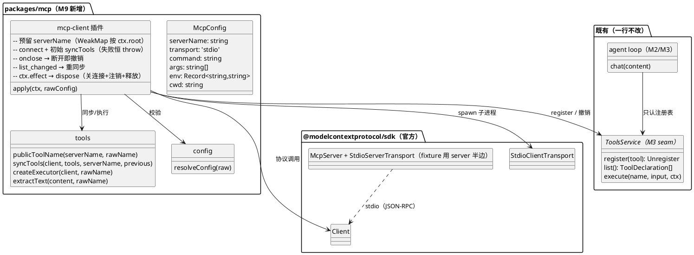
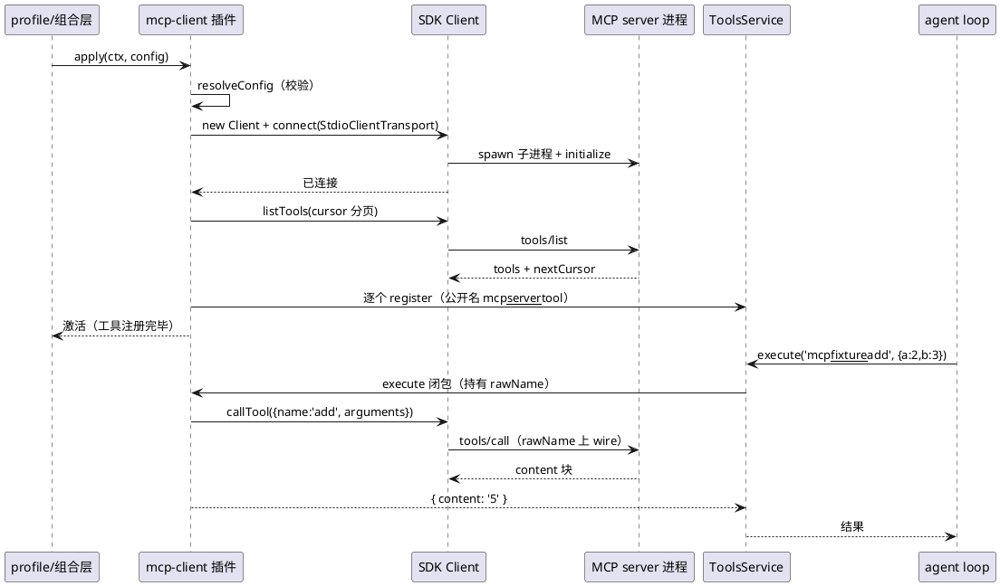
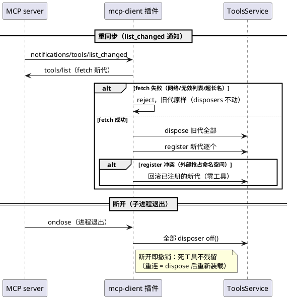

# M9 教程：MCP —— 给 agent 装一个"外部工具插座"

> 面向 **AI 编程小白**：只需要基础 TypeScript 和命令行。本篇所有命令零 API key 可跑，
> 练习由测试脚手架驱动。学完你能回答：一个外部 MCP server 的工具是怎么变成
> `mcp__<server>__<tool>` 出现在模型工具列表里的？为什么"两阶段同步"让工具列表
> 永远要么是完整一代、要么一代没有？以及——为什么这一整章**一行都没改 agent loop**。

## 1. 动机：这个 M 解决什么问题、为什么排在这里

回忆一下 mini 的进度（M0–M8）：

- **M3**：Tools seam——工具 = 声明 + `execute`，bash/文件工具注册进 `ctx.tools`。
- **M6**：一切注册皆可逆——每个注册都返回撤销函数，插件卸载即撤销。
- **M8**：subagent/workflow——agent 会"招人"了。

但直到 M8，工具都长在仓库里：想加一个能力，就得**写一个插件包**。而现实世界里存在
一个庞大的工具生态——GitHub、文件系统、数据库、搜索……几百个社区 server 都通过
**MCP（Model Context Protocol）**暴露工具。它们是**外部进程**，说一种标准协议。

原版 DeepSeek Harness 的答案是 **mcp-client 桥**：连接外部 MCP server，把它的工具
**注册进现有的 Tools 注册表**——之后自动流入现有执行管线。MCP 只是"工具生产者"，
不是一种新的工具类型。

所以 M9 排在这个位置，是因为前面的一切都成了它的积木：

```
M9 的新东西只有"桥"这一层。
┌───────────────────────────────────────────┐
│ 外部 MCP server 进程（stdio 子进程）          │ ← 外部世界
├───────────────────────────────────────────┤
│ mcp-client 桥：连接 → 发现 → 注册 → 撤销     │ ← M9 新增
├───────────────────────────────────────────┤
│ agent loop（M2/M3：只认 tools 注册表）        │ ← 一行不改
│ Tools seam（M3）· 注册可逆（M6）             │ ← 直接复用
└───────────────────────────────────────────┘
```

如果 M9 做成了，"加一个新能力"从"写一个插件包"变成"profile 里加一行配置"——这就是
M11（web search 可插拔示范）要继续演示的形态。

## 2. design：M9 做了什么

交付一个新包 `packages/mcp`（`@mini-dsh/mcp`）：

| 落地物 | 一句话 |
|---|---|
| `src/config.ts` | 手写 `resolveConfig`：非法配置响亮报错、缺省补默认 |
| `src/tools.ts` | `publicToolName`（命名）+ `syncTools`（两阶段同步）+ executor（执行与结果映射）|
| `src/index.ts` | 插件 `apply`：连接、发现、注册、断开撤销、list_changed 重同步、可逆 dispose |
| `examples/fixture-server.mjs` | 仓库内玩具 MCP server（纯 JS，零构建），demo 与 e2e 共用 |
| `examples/mcp-demo.ts` | `pnpm demo:mcp` 三幕零 key 演示 |

### 2.1 组件关系（类图）



### 2.2 启动与工具执行（时序图）



### 2.3 两阶段同步与断开撤销（时序图）



## 3. 新概念（首次出现逐个解释）

- **MCP（Model Context Protocol）**：一个开放协议，规定"工具 server"怎么通过
  JSON-RPC 描述自己的工具（`tools/list`）并执行调用（`tools/call`）。像 USB-C：
  客户端不关心 server 是什么语言写的。
- **stdio transport**：client 与 server 之间最简单的连接方式——client 把 server
  **作为子进程 spawn**，通过它的标准输入/输出传 JSON-RPC 消息。M9 只做这一种
  （另一种主流 transport 是 streamable-http，mini 裁剪掉了）。
- **工具命名空间**：公开名 `mcp__<serverName>__<rawName>` 是
  `(serverName, rawName)` 的**纯函数**。两个 server 都提供 `search` 时共存为
  `mcp__github__search` 和 `mcp__web__search`；连接顺序、别的 server 都不会
  重命名既有工具。
- **两阶段同步**：换工具列表分两步——fetch（拉齐新一代，任何失败不碰注册表）→
  swap（先撤销旧代、再注册新代，冲突回滚整代）。保证模型看到的永远是**完整一代**。
- **断开即撤销**：server 进程一退出，它的工具就全部注销。mini 特意选这个比上游
  （保留"死工具"直到重连）更简单的语义，见 §4 tradeoff。
- **信任边界（trust boundary）**：MCP 工具名、schema、结果都来自外部进程，不能
  按文档上"必填"的字段名去读——mini 把内容块字段全按可选处理。

## 4. tradeoff：关键取舍与理由

- **用官方 SDK，不手写协议**：MCP 只是 JSON-RPC + 一些 schema，手写几百行也
  写得出来——但协议在演进，官方 `@modelcontextprotocol/sdk` 被 Claude
  Desktop/VS Code 等广泛使用。教学版的价值在"桥接"而非"重新发明协议"。
- **只做 stdio，砍 streamable-http**：stdio 足以展示完整链路（spawn → 握手 →
  发现 → 调用 → 断开），HTTP transport 是产品矩阵问题，不是概念问题。
- **断开即撤销，而不是保留死工具**：上游在断线期间保留注册（调用报"Not
  connected"，重连后原位恢复）。mini 选更简单的语义：进程死了工具就消失——
  与 M6"注册可逆"呼应，也杜绝"工具在但永远失败"的半死状态。代价是重连要
  dispose 后重新装载（公开名是纯函数，重建出的名字完全相同，会话历史不失效）。
- **`isError` 是结果不是异常**：MCP 的 `isError:true` 返回
  `{ isError: true, content }`，模型能看到失败原因并自行纠正——和 bash 的
  exit code、skill 的 `{ error }` 同款纪律。只有 transport 级失败（比如进程
  已死）才抛异常，走 loop 的 crash 路径。
- **公开名规范化不 hash**：上游在"替换/截断改变了名字"时追加 12 位 sha256 后缀
  防止碰撞。mini 裁剪为"非法字符替换 `_` + 超长报错"。安全性来自别处：注册表
  重名必抛 + 两阶段同步冲突整代回滚——碰撞只会**响亮地**少一组工具，绝不静默损坏。
- **子进程环境不 scrub**：上游会清掉父环境里名字像凭据的变量（`*KEY*` 等）再传给
  server。mini 直传 `{...process.env, ...config.env}`——更简单；真实场景下你自己
  控制显式 `env` 就好。
- **初始失败恒 throw（fail-fast）**：上游有 `failOnStartupError` 开关（false 时
  "装上但没工具"）。mini 裁剪成"连不上就装不上"——半死状态是 bug 温床，教学版
  宁可响亮失败。

## 5. stepbystep：从头到尾看代码的顺序

所有路径都在 `packages/mcp/` 下。建议顺序：

1. **`src/config.ts`**——入口处的门卫。`resolveConfig` 把 profile 传来的原始
   `options` 校验成 `McpConfig`（serverName 正则、只许 stdio、拒绝未知字段）。
   看懂它，就懂了"配置非法要在连接前响亮报错"。
2. **`src/tools.ts` 上半段（`publicToolName`）**——公开名契约：纯函数、
   非法字符替换、超长报错。再看 `McpClientLike` 窄接口：桥只依赖
   `listTools`/`callTool` 两个方法，单测用假 client，真实现是 SDK Client。
3. **`src/tools.ts` 的 `syncTools`**——两阶段同步本体。对照 §2.3 时序图读：
   fetch 循环 cursor 分页；swap 先旧后新；register 抛错就回滚整代。
4. **`src/tools.ts` 的 `createExecutor` + `extractText`**——执行闭包持有
   rawName（公开名绝不发服务器），text 块 `\n` 连接、非文本块变占位符、
   `isError` 变结果对象。
5. **`src/index.ts` 的 `apply`**——把这些零件接成插件：预留 serverName →
   连接 → 初始同步 → 挂 `onclose`（断开即撤销）、`onerror`（接住非零退出）、
   `list_changed`（重同步）→ `ctx.effect` 挂 dispose。对照 §2.2 时序图读。
6. **`examples/fixture-server.mjs`**——反过来看 server 半边：用 SDK 的
   `McpServer` 注册六个工具（`add`/`greet`/`fail`/`image`/`crash`/
   `admin.reset`），每个刻意覆盖桥的一个路径。它是纯 JS，`node` 直跑零构建。
7. **`tests/`**——按 T2→T7 的层级读：`config`/`naming`/`sync`/`executor`
   用假 client 测纯逻辑；`plugin.test.ts` mock 掉 SDK 测生命周期；
   `mcp.e2e.test.ts` 拉真子进程测真协议（fixture + 官方 filesystem）。
8. **`examples/mcp-demo.ts`**——`pnpm demo:mcp` 三幕：工具在列 → 真调用入
   轨迹 → crash 断开即撤销 + 重装恢复。

## 6. 动手练习：写一个骰子 MCP server 并接进 mini（零 key）

目标：照 `fixture-server.mjs` 的样子写一个自己的 MCP server（一个工具
`random_dice`），然后写测试让 mini 的 mcp-client 连上它。

**练习 1：你的 server**——`packages/mcp/examples/my-dice-server.mjs`（已建好，
先读一遍，运行测试后试着改）：

```js
import { McpServer } from '@modelcontextprotocol/sdk/server/mcp.js'
import { StdioServerTransport } from '@modelcontextprotocol/sdk/server/stdio.js'
import { z } from 'zod'

const server = new McpServer({ name: 'my-dice-server', version: '1.0.0' },
  { capabilities: { tools: {} } })

server.registerTool('random_dice', {
  title: 'Random Dice',
  description: '掷一个指定面数的骰子。',
  inputSchema: { sides: z.number().int().min(2).describe('面数').default(6) },
}, async (args) => {
  const sides = args.sides ?? 6
  const n = 1 + Math.floor(Math.random() * sides)
  return { content: [{ type: 'text', text: `🎲 掷出了 ${n}（${sides} 面骰）` }] }
})

const transport = new StdioServerTransport()
await server.connect(transport)
```

**练习 2：你的测试**——`packages/mcp/tests/my-dice.test.ts`（已建好）：

```sh
pnpm vitest run packages/mcp/tests/my-dice.test.ts
```

**红绿翻转（小白验收）**：把 `my-dice-server.mjs` 里工具名 `random_dice` 改成
`dice`，再跑上面的测试——红（发现不到 `mcp__mydice__random_dice`）。改回来——绿。
这一个来回就是"公开名是 `(serverName, rawName)` 纯函数"的活体验证。

## 7. 收尾：对照验收清单

- [ ] `pnpm vitest run packages/mcp/tests/` 全绿（55+ 测试，含真 stdio e2e）
- [ ] `pnpm demo:mcp --clean` 三幕走通
- [ ] `pnpm demo:web:fake --clean`：第二轮 tool 卡片是 `mcp__fixture__add`
- [ ] 练习红绿翻转亲手做过一遍

## 8. 下一步

M10（plan/todo）与 M11（web search）都会沿用这一章的模式：能力 seam + 工具 +
事件。M11 尤其直接：web search 是 mini 的第一个**外部 HTTP** 工具插件，把
"profile 加一行即获能力"推到台前。
